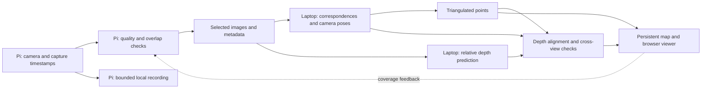

# ADR-002: Better room mapping from the existing camera

**Date:** 25 September 2026. **Status:** Learned matching, inferred fusion, live
depth/localization experiments and capture controls implemented. The proposals
below preserve the design history; use the [latest experiment ledger](mapping-experiments-2026-09-25.md)
for what was tested, adopted, rejected or remains pending.

## Latest stability finding

The calibrated 222-frame chair lap is not yet a reliable full map. Repeated
builds disagree despite high camera counts. Stricter geometry recovers a much
more repeatable ~100-view fragment, ending at a blurred transition near 38 seconds.
The immediate priority is tracking continuity, followed by physical dimension
checks. AI depth completion stays downstream of that. Future learned builds now
run an automatic repeatability check; see the current experiment ledger for
matcher/solver comparisons. Earlier proposals below are retained as history.

## Decision

Keep the Pi responsible for clean, timestamped capture. Use the confirmed Apple
M5 laptop (24 GB RAM) for learned features, reconstruction and inferred depth.
The immediate working upgrade is **XFeat correspondences + COLMAP geometry**.
Keep standard COLMAP available for comparison. Improve exposure and keyframes
next; add depth only as a clearly labelled prior until cross-view geometry agrees.

No Quest, cloud upload or new sensor was required for these experiments.

## Results on our actual recordings

| Experiment | Result | Interpretation |
| --- | --- | --- |
| First walk, standard SIFT with broader matching | 56/236 views; 245 points | Partial coverage |
| Same first walk, XFeat + mutual matching + COLMAP | **224/236 views; 7,865 points**, one component; 268 s | Much better connectivity, slower total build; solver emitted numerical warnings, so inspect geometry |
| Second walk, standard SIFT | 49/97 views; 1,296 points | Improved capture, still partial |
| Same second walk, XFeat + COLMAP | **97/97 views; 9,149 points** in the selected component; **34.4 s** | All views registered; metric scale and physical accuracy remain unvalidated |
| Second walk, sharpest frame per ⅔-second window | 97 → 50 input images; only 22 selected views registered, 846 points; 5.0 s | Simple thinning hurt reconstruction. Do not enable this as the default. Timing included another research workload |
| Core ML Depth Anything V2 Small, F16 | **21.3 ms median warm inference**, 518×392 input; ~50 MB model | Practical inferred-depth preview on this Mac; not a measured or persistent map |

All recorded images remain intact. Historical standard reconstructions remain
under each session's `reconstructions/`. The dashboard now offers **Stronger
matching**, and those models are explicitly labelled experimental. Camera count
and reprojection error are diagnostics, not ground-truth map accuracy.

**Scope correction from Evan:** the second scan mainly focused on a chair.
Its 97/97 registration result is evidence of image connectivity for that
object-focused scan, not evidence that the room was covered or the chair's
physical dimensions were reconstructed correctly.

The XFeat pair benchmark used 32 pairs sampled from the first walk. With at most
1,024 keypoints, XFeat had ≥30 fundamental-matrix inliers on 27 pairs, SIFT on 10,
and ORB on 11. Median extraction was 25.6 ms, 14.9 ms and 1.94 ms respectively;
Torch used four CPU threads and OpenCV one. This was a practical comparison of
the complete selected feature/matcher settings, not a controlled equal-thread
benchmark. Geometry verification is excluded from those extraction timings.

The Mac PyCOLMAP wheel has SIFT support but lacks compiled ONNX support despite
exposing ALIKED/LightGlue enum names. Simply changing an option would not work.
XFeat runs in a separate Python 3.12 environment; COLMAP runs in its existing
environment, avoiding a reproduced duplicate-OpenMP-runtime crash.

## Priorities and alternatives

| Priority | Change | Benefit | Limit / decision |
| --- | --- | --- | --- |
| 1 | Shorter, verified exposure; more light | Prevent motion blur before it enters the estimator | Test an 8–12 ms budget against brightness/noise. Current median is 41.6 ms; shorter exposure needs more light or gain. Not deployed yet |
| 1 | XFeat + geometry verification | Recovers matches that SIFT lost on our footage | Working experimental button. It improves robustness, not necessarily total speed |
| 2 | Choose a sharp frame from each short burst, then use motion/feature overlap for keyframes | Avoid blurry samples and redundant optimization while preserving bridges between views | Evaluate 12–24 fps candidates, keep about 3 fps. Preserve exact image metadata and a maximum time gap. Offline ⅔-second thinning alone failed; live burst selection is not implemented |
| 2 | Calibrate this exact lens, processed resolution and rotation | Reduce focal-length/distortion ambiguity during optimization | Requires a real calibration capture; do not turn a guessed FOV into a calibration |
| 3 | Depth Anything V2 Small on the Mac | Dense estimated surfaces in observed, poorly textured regions; fast preview | Locally tested. Relative depth requires alignment, camera poses and cross-view consistency before fusion |
| 3 | ORB-SLAM3 / lightweight feature-based live tracking | A live camera pose and relocalization instead of waiting for a full build | Needs calibrated, higher-rate images and a new adapter; the 3 fps archive is not a validated live/VIO input |
| Later | Read-only FC IMU + calibrated VIO | Rotation and short-gap constraints; eventual metric scale observability | Characterize timing, noise, units and camera/IMU extrinsics first. Existing combined IMU/motor utility is unsuitable |
| Optional comparison | ALIKED + LightGlue, XFeat + LighterGlue | More capable correspondence matching | Additional integration/dependencies; do not replace the tested matcher solely from published benchmarks |
| Low priority | NAFNet deblurring | May recover matchable detail from old images | Keep originals and accept only cross-view-verified geometry. Visual sharpness alone does not establish faithful recovery |
| Defer | MASt3R-SLAM / large learned dense reconstruction | Strong reconstruction priors | Upstream installation requires CUDA; not the lowest-effort path on this M5/Pi setup |

Raspberry Pi's `AeExposureMode=Short` prefers shorter exposures but is **not** an
8–12 ms hard cap. Verify `ExposureTime` in actual completed-request metadata.
Avoid changing frame rate/sensor mode casually: it can change crop and calibration.
The proposed exposure/burst settings have not replaced the running camera profile.

## How a lightweight model can fill gaps

Use learned depth as a prior for **observed surfaces**. With a reliable pose,
align each predicted relative-depth image against sparse triangulated points,
including scale/shift where appropriate. Reproject it into neighboring views;
accept only consistent regions and retain uncertainty. Fit supported wall/floor
planes only after gravity/scale/registration are established. Keep three layers:
triangulated observations, model-inferred surfaces, and unknown space.

One-image depth does not establish a stable multi-frame coordinate system, metric
clearance, or surfaces behind occluders. The sample depth image looks plausible,
but its accuracy and temporal consistency have not been measured. A moving rig
still needs pose tracking; adding a depth model does not remove that work.

## Speed plan

On the first learned run, extraction took 6.3 s and matching 3.3 s; geometric
verification took 38 s and optimization 220 s. On the second, the stages were
2.6 s, 1.0 s, 3.4 s and 27.3 s. The dominant cost is geometry optimization.
Use overlap-aware keyframes and revisit selection, reuse features, and investigate
showing provisional snapshots while a final refinement runs. Measure time to first
usable geometry separately from final completion. These are next changes, not
features already available in the viewer.

## Proposed Pi/laptop processing split

The architectural objective is a responsive live observation path plus a map that
improves as new views arrive. Full independence from the laptop is a separate
requirement; it has not been established by the current offline experiment.

This diagram is a proposed extension. Current Pi capture, saved images, offline
pose/point reconstruction and the browser viewer work; live tracking, coverage
feedback and depth fusion do not yet exist. The flight controller remains the
owner of flight stabilization; neither this map nor monocular inferred depth is
currently a flight-control or collision-clearance input.

### Who does what

| Stage | Proposed location | Reason / exit condition |
| --- | --- | --- |
| Capture, exposure metadata, blur/brightness score, image buffer | Pi | Preserve evidence at the source; these basic checks do not require a neural model |
| Overlap and motion checks, selecting keyframes | Pi if profiling allows | Cheap feature tracking can keep useful view transitions. Keep a maximum time gap and report lost tracking rather than silently discard all difficult frames |
| Learned descriptors such as XFeat | Laptop first; Pi trial later | Already tested on laptop. Move only if total capture-to-pose latency, sustained thermals or connection independence improves |
| Camera poses, triangulation, revisits and global refinement | Laptop initially | Establish the shared coordinate system and correct accumulated drift |
| Learned relative depth on selected frames | Laptop | The tested Core ML model takes ~21 ms warm inference here; that is not an end-to-end fused-map rate or a Pi benchmark |
| Depth alignment, temporal checks, surface fusion | Laptop | Needs camera intrinsics, poses and access to multiple views and the shared map |
| Saved map and rendering | Laptop storage; browser renderer | One persistent map with provenance; no cloud or Meta dependency |

A camera frame yields 2D pixels. A feature extractor yields 2D keypoints and
descriptors, not 3D coordinates. Matching observations across views allows camera
motion and 3D points to be estimated. A single-image depth model supplies a
different kind of information: a learned estimate of relative scene depth.
Depth can be predicted in parallel with pose estimation, but stable map fusion
must wait for a valid pose and alignment. Bad poses make even plausible depth
images accumulate into doubled or smeared surfaces.

### Three different meanings of a gap

1. **Visible surface with few triangulated points:** the chair seat or a plain
   wall is visible, but has little texture. Align predicted depth to well-supported
   sparse points, then check it by projection into additional views. Fuse only
   supported pixels; use robust fitting and reject poorly constrained alignment.
   Depth discontinuities and thin chair legs need special care to avoid joining
   foreground and background. Retain inferred provenance after acceptance.
2. **Missing camera tracking:** blur or a large viewpoint change prevents linking
   frames. Use better correspondences, overlapping captures, relocalization and
   eventually calibrated IMU constraints. Depth prediction alone does not recover
   a reliable camera trajectory.
3. **Never-observed surface:** the far side of a chair or space behind a wall.
   Learned shape completion can suggest a visual hypothesis, but it remains a
   separate speculative layer. It cannot certify an obstacle or free space.

### Data and scheduling

Retain original images and link derived outputs by session ID, frame ID, sensor
timestamp, camera generation and calibration ID. Send selected JPEGs with exact
metadata first; add optional descriptors or local pose/covariance only when those
are available. Host and sensor clocks remain distinct until synchronization is
measured. An inference completing late must remain attached to its original frame.

Feature-only transport is not automatically compression. The 97 chair JPEGs have
a median size of **54,384 bytes** and mean of **55,490 bytes**. At 1,024 keypoints,
64-D float32 XFeat descriptors alone occupy **262,144 bytes**, excluding positions
and framing. Int8 descriptors would be 65,536 bytes before metadata and require
an accuracy-tested quantization scheme; this is arithmetic, not a tested encoder.
The laptop also needs images for depth and color. Consider sending compact
tracks/poses plus occasional images only once onboard tracking is proven.

Separate fast tracking from slower map refinement. Tracking should consume
timestamped, sufficiently frequent views; dense updates can process a smaller
keyframe subset asynchronously. Explore 2–5 dense updates per second as an initial
budget, not a measured capability. Always report pose age and tracking state.
Bound each work queue: preview may skip stale images, while map keyframes require
overlap-aware selection. Keep originals locally for interrupted-link recovery.

On a connection drop, buffer the recording and mark the laptop pose stale. An
optional onboard tracker could continue a local estimate, but needs measured
drift/relocalization behavior before it offers autonomy. If the reported Hailo
accelerator is present, inventory the exact device and supported runtime/model
first; do not assume a Mac Core ML package can run on it.

### Which architecture to choose now

| Option | Advantage | Tradeoff | Recommendation |
| --- | --- | --- | --- |
| Pi capture/quality + laptop mapping/depth | Uses the pipeline and M5 inference already measured; preserves flexible reprocessing | Live map depends on the link | Start here |
| Pi feature extraction/local tracking + laptop global map | Potentially steadier local tracking and compact pose updates during limited connectivity | More Pi CPU/thermal work, synchronization and recovery complexity; descriptors may increase bandwidth | Benchmark after the saved-scan depth experiment |
| Pi-only dense mapping | Independent from the laptop | Unmeasured compute, memory, thermal and power budget; current model deployment differs | Defer until independence is a concrete requirement |

**Next bounded experiment:** use the existing chair recording and recovered poses
to test a separate inferred-depth surface layer. Fit the appropriate depth or
inverse-depth alignment using only a subset of supported points/views, evaluate
held-out reprojection and depth consistency, mask occlusions/moving objects, and
inspect whether the seat/legs retain their shape from new viewpoints. Record
alignment failure and uncertainty rather than fill every pixel. Physical scale
still requires a measured reference. If this improves the observed chair without
inventing solid surfaces across gaps, integrate streaming pose estimation and
incremental fusion. This order tests whether AI helps our map before relocating
models onto the drone.

## Evidence and reproduction

See [Mapping/RESEARCH.md](../Mapping/RESEARCH.md). Results and downloaded model
provenance are stored under `Saved/MappingResearch/`; this ignored directory is
not a backup. The first learned result is also published as an immutable revision
of the original recording, and the second was built through the dashboard API.

Primary references: [Picamera2 manual](https://datasheets.raspberrypi.com/camera/picamera2-manual.pdf),
[XFeat authors and LighterGlue](https://github.com/verlab/accelerated_features),
[COLMAP feature support](https://colmap.github.io/features.html),
[LightGlue authors](https://github.com/cvg/LightGlue),
[Apple's Core ML depth model](https://huggingface.co/apple/coreml-depth-anything-v2-small),
[Depth Anything V2 authors](https://github.com/DepthAnything/Depth-Anything-V2),
[ORB-SLAM3](https://github.com/UZ-SLAMLab/ORB_SLAM3),
[NAFNet authors](https://github.com/megvii-research/NAFNet),
[MASt3R-SLAM authors](https://github.com/rmurai0610/MASt3R-SLAM).
