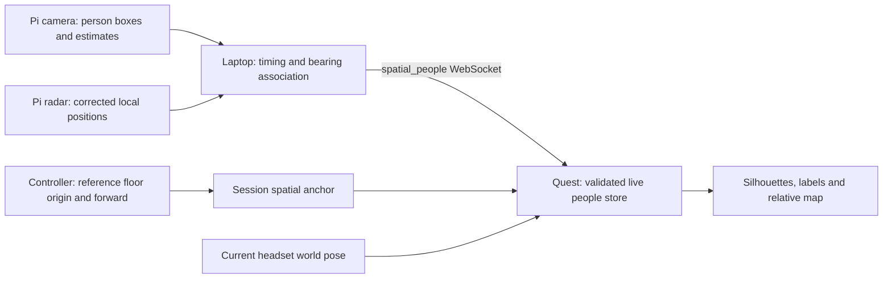

# Stationary sensor people integration

Implemented on `codex/quest-ground-station-integration` after merging
`origin/sensor-rig-integration` at `7f8f7e5` with user authorization. The merge
fast-forwarded the local integration branch; it did not update remote main.
Use the [ground-station runbook](../GroundStation/README.md) for setup and protocol.



## Reference transform

Controller placement connects the physical rig's configured reference to a
stationary Meta spatial anchor. An anchor alone cannot discover an external
sensor's location. See [Meta spatial anchors](https://developers.meta.com/horizon/documentation/unreal/unreal-spatial-anchors/).
For reference origin O, horizontal forward/right axes F/R and W = WorldToMeters:

```text
world = O + W × (forward_m × F + right_m × R)
view = ProjectContact(world, headset_world_position, headset_world_yaw, W)
```

Unreal uses +X forward, +Y right, +Z up. Range in the HUD is horizontal, not the
slant distance from headset eyes to a person's assumed foot point. Walking and
turning change relative range/bearing without moving a stationary world contact.
Camera projection uses the existing [pinhole model](https://docs.opencv.org/4.1.2/d9/d0c/group__calib3d.html).
Parallel camera/radar axes share the configured mount yaw; corrected radar
positions receive no second mount correction.

Native live people use a separate validated store, the existing human renderer,
and shared anchor teardown. Recenter, lifecycle restart/resume, source restart
or reference changes clear registration. Sensor reconnects clear associations.
Physical movement requires explicit replacement using A. No cross-session
reference persistence, inferred posture, radar-only person classification, or
tracking after camera loss is provided.

## Evidence as of 2026-09-19

| Validation | Result |
| --- | --- |
| Pi regression and Pi-packet-to-fusion contract | 43 tests pass, Python 3.12. |
| Laptop matching, replay, HTTP, configuration and real loopback sockets | 46 tests pass. |
| Unreal parser, ordering/expiry, world math and renderer state | Four automation tests added; not run here. |
| Unreal full regression, Android build/cook | Pending: no local Unreal installation. |
| Browser visual QA | Unverified: browser tool could not initialize authentication; HTTP/assets are tested. |
| Live sensors → laptop → physical Quest | Pending physical acceptance. |

## Headset acceptance procedure

Run the native build and full existing Unreal suite before hardware checks. Use
recorded real Pi packets with the laptop replay server to exercise the native
parser/render path; verify the REPLAY label and expiry after playback ends.
Then use a live stationary rig:

1. Measure camera offset and confirm one-person left/centre/right alignment
   before enabling radar matching. Record the Pi mount, camera HFOV, firmware,
   packet recording and native build identifier with the results.
2. Calibrate floor origin and forward direction. Reject forward points less than
   0.5 m away. Confirm A restarts both placement steps and B controls visibility.
3. At measured distances (for example 1, 2 and 4 m), place a person left, centre
   and right. Record ground-truth right/forward, displayed right/forward, radial
   and lateral error in metres, and position source. Repeat registration to
   estimate controller-placement error separately from sensor error.
4. Walk 1 m toward a stationary target, then turn 90 degrees. The silhouette
   stays at its world position; horizontal range decreases by 1 m and bearing
   changes with the current headset world orientation.
5. Test two people, then crossing and overlapping bearings. Confirm one-to-one
   matches, visible ESTIMATED fallback during ambiguity, stable camera identity
   during source changes, and no duplicate blue dot for a displayed match.
6. Interrupt radar, camera, Pi-to-laptop and laptop-to-Quest connections
   separately. Radar loss switches promptly to a valid estimate; camera loss
   removes people. Expiry continues during repeated packets and stalled links.
   Clipped boxes without a match stay unpositioned; radar-only returns stay dots.
7. Lose tracking/anchor localization, recenter, resume the app and move the rig.
   Silhouettes hide during invalid tracking; required recalibration prevents old
   placement reuse. Press A after physical rig movement.
8. Verify both eyes, passthrough visibility, readable green RADAR/amber ESTIMATED
   labels and eight-person limits. Repeat normal manual placement/navigation
   without `-WallhackSensorPeople` and verify their established controls.

Report observed error and failure behavior; do not infer physical accuracy from
unit-test success. Network transit delay is not clock-compensated by this
version, so record end-to-end latency on the actual deployment network too.
