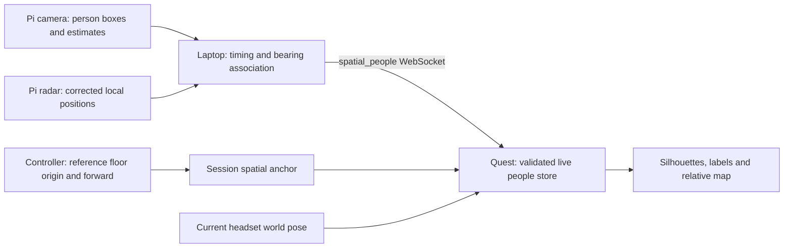

# Stationary sensor people integration

Integrated on `pi-sensor-pull-test` from `origin/codex/pi-sensor-people-test`
at `c1cdbd5` (which includes `sensor-rig-integration` at `7f8f7e5`). The branch
preserves the current HUD/stereo fixes and the session map-memory checkpoint
`dc4aae8`. Local and remote `main` were not changed by this integration.
Use the [ground-station runbook](../GroundStation/README.md) for setup and protocol.

## Interpolation and laptop diagnostics update

The current Quest build interpolates fresh per-person positions over 120 ms in
sensor-reference coordinates, then applies the current spatial-anchor transform.
Camera and radar tracks use separate IDs plus reconnect generations. Repeated
positions do not restart the blend; no extrapolation or freshness extension is
performed. Missing/expired contacts disappear immediately. Tracking/anchor loss,
Hidden, re-registration, a rendering pause over 250 ms or a position jump over
1.5 m discards interpolation history. Native labels/maps use the same smoothed
position as the silhouette.

The laptop dashboard at `http://localhost:8766/` retains the camera feed and radar
map and adds a combined sensor map, association links, bearing-only rays, recent
trails, per-contact counts/cards and a detailed observation table. Select a track
to graph its range, right/forward coordinates or camera model score for the last
30 seconds. Sensor age graphs, track/source events, raw observation/packet
inspectors and JSON download expose the remaining timing and calibration data.
Exports include browser response age/error; coasting detections have no new
score sample. Graphs show observations and positions sent to Quest before its
interpolation, not measured headset rendering. User requested the detailed view
on the laptop only.

Current validation: 80 Unreal regressions pass without warnings, 49 relay tests
pass, and the real loopback Pi/relay/native actor test passes. Browser checks
cover feeds, source transitions, contact selection, snapshot download, stale
removal, coasting observations, source resets and mobile layout. Full Android
ASTC cook succeeds (150 s), with 28 package checks and v2 signature verification.
Evidence is in `Saved/PiSensorPullTest/SmoothingDiagnostics/`,
`SmoothingDiagnosticsBrowser/`, `diagnostics-ground-tests.log`, and
`Saved/NavigationVerification/TestRuns/20260920-020705/Report/index.json`.
The preceding APK is preserved as
`Saved/PiSensorPullTest/Rollback-BeforeSmoothing.apk`.

At installation the laptop was on 172.20.10.2, Quest had moved to 10.26.0.248
and was asleep, and the Pi hostname/172.20.10.3 were unreachable. The updated
laptop dashboard is running and open. New-build physical smoothness, alignment,
stereo and performance checks await the devices returning to the same network.
The earlier live boot/checks succeeded before this network change; latest
operational evidence is kept in `Saved/PiSensorPullTest/live-integration-status.json`.



## Reference transform

Controller placement connects the physical rig's configured reference to a
stationary Meta spatial anchor. An anchor alone cannot discover an external
sensor's location. See [Meta spatial anchors](https://developers.meta.com/horizon/documentation/unreal/unreal-spatial-anchors/).
For reference origin O, horizontal forward/right axes F/R and W = WorldToMeters:

```text
world = O + W × (forward_m × F + right_m × R)
view = ProjectContact(world, headset_world_position, headset_world_yaw, W)
```

Unreal uses +X forward, +Y right, +Z up. Range in the HUD is horizontal, not the
slant distance from headset eyes to a person's assumed foot point. Walking and
turning change relative range/bearing without moving a stationary world contact.
Camera projection uses the existing [pinhole model](https://docs.opencv.org/4.1.2/d9/d0c/group__calib3d.html).
Parallel camera/radar axes share the configured mount yaw; corrected radar
positions receive no second mount correction.

Native live people use a separate validated store, the existing human renderer,
and shared anchor teardown. Recenter, lifecycle restart/resume, source restart
or reference changes clear registration. Sensor reconnects clear associations.
Physical movement requires explicit replacement using A. No cross-session
reference persistence, inferred posture or radar-only person classification is
provided. Independent radar returns now get generic RADAR ONLY silhouettes,
including during camera loss, until their own observations expire.

## Evidence as of 2026-09-20

| Validation | Result |
| --- | --- |
| Pi regression and Pi-packet-to-fusion contract | 44 tests pass on Windows Python 3.14.6 and the physical Pi's Python 3.13.5. Includes shutdown with a relay still attached. |
| Laptop matching, replay, HTTP, configuration and real loopback sockets | 49 tests pass on Windows, including diagnostic freshness, brief receive pauses and sustained stalls. Previous 46-test suite passed on Pi. |
| Full Unreal regression, including five sensor tests | 80 tests pass, zero test warnings/failures, UE 5.7.4. |
| Actual Pi bridge → laptop relay → Unreal socket/actor | Additional `SensorSetup.NativeRelay` test passes with synthetic input and real loopback sockets. |
| Detector runtime | Real YOLOX ONNX inference on a blank image succeeds; 32.81 ms in the latest browser run. This is not a Pi benchmark or accuracy evaluation. |
| Browser visual QA | Both Pi and laptop dashboards pass Edge checks: desktop/mobile/Quest viewport, WebSocket, fullscreen, failure/recovery, no JS errors. Screenshots reviewed. |
| Android build/cook | Full ARM64 ASTC build/cook succeeds (150 s); APK signature v2 and native-library hash verified. 28 package checks pass, including network/scene/anchor permissions and stereo renderer configuration. |
| Live Pi camera/radar transport | Updated service: 40 fresh camera and radar packets over four seconds, maximum sampled radar age 86.4 ms. Metadata accepted by laptop relay; no protocol error. |
| Quest installation | Installed over USB; pulled APK SHA256 matches the verified candidate. |
| Native Quest → laptop connection | Preceding build connected over hotspot Wi-Fi. New build is installed; launch requested against `10.26.0.247:8765`, but Quest is asleep, with no app process or relay client. |
| Live sensors → laptop → physical Quest | Wearer confirmed two-point registration and a visible live ESTIMATED silhouette on the preceding build. Alignment while moving, both-eye visibility and independent radar behavior remain pending the next cycle. |

The integration fixed UE 5.7 `TObjectPtr` compilation errors, an uninitialized
parser variable, and an overstrict float tolerance in the incoming yaw test.
Sensor silhouettes now use the shared stereo-tested corner labels with the
actual viewer pose. Labels identify RADAR/ESTIMATED/RADAR ONLY and explicitly assumed body
height/facing; the duplicate TextRender path was removed. Manual contact colors
and the existing navigation mode are preserved. Sensor mode is opt-in and does
not currently provide navigation to live sensor contacts.

The local integration harness uses known camera boxes through the production
tracker/projection pipeline and encoded LD2450 packets through the real radar
decoder. It verifies camera fallback, independent radar during camera loss, frozen-frame expiry,
recovery and both web dashboards. The native test additionally verifies floor
registration, rejection of a short forward vector, wearer motion, Hidden mode,
and registration invalidation on source restart. Synthetic relay output is
marked replay; no camera or serial device is opened by this harness.

Local evidence (generated, not committed):

- `Saved/PiSensorPullTest/ground-tests.log` and `pi-tests.log`.
- `Saved/NavigationVerification/TestRuns/20260919-231624/Report/index.json`.
- `Saved/PiSensorPullTest/Integration/result.json`, `actual-relay-packet.json`,
  `Native/Report/index.json`, and `pi/` / `ground/` browser screenshots.
- `Saved/PiSensorPullTest/IntegrationAfterShutdownFix/result.json`: native
  loopback chain passes again after the live-discovered shutdown fix.
- `Saved/PiSensorPullTest/IndependentSensors/result.json` and `Native/Report/index.json`:
  both independent sensor paths, match deduplication, simultaneous expiry,
  recovery and source restart pass through the real native actor. Browser
  source-transition screenshots include `ground/fusion-radar-only.png`.
- `Saved/PiSensorPullTest/or-ground-tests.log` and
  `Saved/NavigationVerification/TestRuns/20260920-001509/Report/index.json`.
- `Saved/PiSensorPullTest/pi-host-tests.log`, `pi-host-ground-tests.log`,
  `pi-deployment.json`, `live-pi-updated-handoff.json`, and `live-relay-updated.json`.
- `Saved/NavigationVerification/package-verification.json`, `signing.txt`,
  `FullPackage.log`, and `delivery.json` for the Android candidate.

The Pi is reachable at `larp-pi.local` (`172.20.10.3`) from the laptop hotspot
address `172.20.10.2`. Its previous service lacked session, generation and
capture-time metadata. The new code is deployed separately at
`/home/evanl1307/HTN2026/sensor-test/pi-sensor-pull-test-028ad24`, with the
shutdown fix applied and existing radar/detector calibration copied. The
original checkout remains available for rollback; `pi-deployment.json` records
its command and working directory. Current process ID is recorded on the Pi in
`/home/evanl1307/HTN2026/sensor-test/camera_dashboard.pid`.

Restarting exposed a real bridge shutdown defect: closing the listener left
established WebSocket connections alive and prevented process exit. The old
process required a targeted forced exit after graceful shutdown failed. The
fix explicitly stops handlers and closes attached connections, with a bounded
close timeout. A new regression passes on both hosts. The replacement passed
live camera/radar health checks, and the laptop now accepts its metadata.

The candidate is installed on Quest 3S and its pulled APK hash matches. On the
preceding build, moving it to the hotspot and unlocking allowed sensor-mode
GameActivity to connect to `ws://172.20.10.2:8765/`, with one native client.
Radar matching is enabled with the wearer-confirmed camera offset of +0.032 m
right and +0.0128 m forward; both sensors are level and parallel. The radar is
0.014 m higher than the camera (camera up-offset: -0.014 m). This vertical
separation is recorded as mount geometry only: the current fusion uses
right/forward floor-plane positions, and camera range comes from full-body box
height, not a sensor-height/ground-ray intersection. It does not move silhouette
feet off the registered floor. Full-body camera observations can supply
ESTIMATED contacts; clipped people without an associated range remain
unpositioned. The wearer confirmed a visible live silhouette; physical
position-error measurement, stereo and Quest performance remain pending. The
offset and matching setting are saved in `Saved/GroundStation/fusion.json`.
Reference placement must be repeated after this configuration change.
Independent rendering does not wait for camera/radar matching. Reported mount
geometry is confirmed; left/centre/right position accuracy is not yet verified.

The independent-sensor update promotes unmatched radar returns from map dots
to blue, explicitly unclassified RADAR ONLY bodies. Camera and radar identities
use C/R prefixes, and confirmed matches retain one shared body. Eight bodies
are allowed in total; additional radar returns stay on the map. Freshness
remains 750 ms for camera and 500 ms for radar. On the deployment hotspot,
one-second receive pauses previously caused needless upstream disconnects.
The relay now tolerates short pauses while observations expire, reconnecting
after a five-second sustained stall. No stale-data lifetime was extended.

During this update the laptop/Quest changed networks to 10.26.0.247/10.26.0.248.
The Pi hostname and its previous 172.20.10.3 address were unreachable. The updated
laptop relay is running; the live Pi check awaits reconnection. The full cook
initially hit a 127.0.0.1:18777 editor-plugin port conflict with the native test
process; the sequential retry succeeded. Run the native integration test and
cook sequentially. Quest is currently asleep: launch was requested with the new
laptop address but no app process or relay client appeared. Unlock and launch
again for the next live cycle after the Pi is reachable.
The previous map-memory APK is retained as
`Rollback-Navigation-BeforePiSensorPullTest.apk`. The immediately preceding sensor
build is retained at `Saved/PiSensorPullTest/Rollback-BeforeIndependentSensors.apk`.

Candidate APK SHA256:
`1326C84F0420C42E04C3C03A58DFEC8CDAD42907C38663850BE7418C52BA607E`.
Packaged native-library SHA256:
`A575CD302C77FA02B201B27CABE2E5A706929A0FE41DB0DA0C25FD6B5652262A`.

## Headset acceptance procedure

Run the native build and full existing Unreal suite before hardware checks. Use
recorded real Pi packets with the laptop replay server to exercise the native
parser/render path; verify the REPLAY label and expiry after playback ends.
Then use a live stationary rig:

1. Measure camera offset and confirm one-person left/centre/right alignment
   before enabling radar matching. Record the Pi mount, camera HFOV, firmware,
   packet recording and native build identifier with the results.
2. Calibrate floor origin and forward direction. Reject forward points less than
   0.5 m away. Confirm A restarts both placement steps and B controls visibility.
3. At measured distances (for example 1, 2 and 4 m), place a person left, centre
   and right. Record ground-truth right/forward, displayed right/forward, radial
   and lateral error in metres, and position source. Repeat registration to
   estimate controller-placement error separately from sensor error.
4. Walk 1 m toward a stationary target, then turn 90 degrees. The silhouette
   stays at its world position; horizontal range decreases by 1 m and bearing
   changes with the current headset world orientation.
5. Test two people, then crossing and overlapping bearings. Confirm one-to-one
   matches, visible ESTIMATED fallback during ambiguity, stable camera identity
   during source changes, and no duplicate blue dot for a displayed match.
6. Interrupt radar, camera, Pi-to-laptop and laptop-to-Quest connections
   separately. Radar loss switches promptly to a valid estimate; camera loss
   keeps fresh radar returns visible as RADAR ONLY silhouettes. Expiry continues
   during repeated packets and stalled links. Both sources stale removes all
   bodies. Clipped boxes without a match stay unpositioned; independent radar
   returns still supply their own silhouettes.
7. Lose tracking/anchor localization, recenter, resume the app and move the rig.
   Silhouettes hide during invalid tracking; required recalibration prevents old
   placement reuse. Press A after physical rig movement.
8. Verify both eyes, passthrough visibility, readable green RADAR/amber ESTIMATED/blue RADAR ONLY
   labels and eight-person limits. Repeat normal manual placement/navigation
   without `-WallhackSensorPeople` and verify their established controls.

Report observed error and failure behavior; do not infer physical accuracy from
unit-test success. Network transit delay is not clock-compensated by this
version, so record end-to-end latency on the actual deployment network too.
