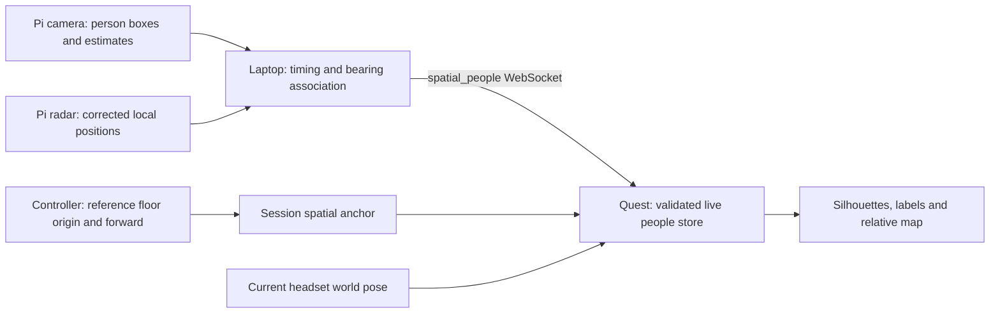

# Stationary sensor people integration

Integrated on `pi-sensor-pull-test` from `origin/codex/pi-sensor-people-test`
at `c1cdbd5` (which includes `sensor-rig-integration` at `7f8f7e5`). The branch
preserves the current HUD/stereo fixes and the session map-memory checkpoint
`dc4aae8`. Local and remote `main` were not changed by this integration.
Use the [ground-station runbook](../GroundStation/README.md) for setup and protocol.



## Reference transform

Controller placement connects the physical rig's configured reference to a
stationary Meta spatial anchor. An anchor alone cannot discover an external
sensor's location. See [Meta spatial anchors](https://developers.meta.com/horizon/documentation/unreal/unreal-spatial-anchors/).
For reference origin O, horizontal forward/right axes F/R and W = WorldToMeters:

```text
world = O + W × (forward_m × F + right_m × R)
view = ProjectContact(world, headset_world_position, headset_world_yaw, W)
```

Unreal uses +X forward, +Y right, +Z up. Range in the HUD is horizontal, not the
slant distance from headset eyes to a person's assumed foot point. Walking and
turning change relative range/bearing without moving a stationary world contact.
Camera projection uses the existing [pinhole model](https://docs.opencv.org/4.1.2/d9/d0c/group__calib3d.html).
Parallel camera/radar axes share the configured mount yaw; corrected radar
positions receive no second mount correction.

Native live people use a separate validated store, the existing human renderer,
and shared anchor teardown. Recenter, lifecycle restart/resume, source restart
or reference changes clear registration. Sensor reconnects clear associations.
Physical movement requires explicit replacement using A. No cross-session
reference persistence, inferred posture, radar-only person classification, or
tracking after camera loss is provided.

## Evidence as of 2026-09-19

| Validation | Result |
| --- | --- |
| Pi regression and Pi-packet-to-fusion contract | 43 tests pass, Windows Python 3.14.6. |
| Laptop matching, replay, HTTP, configuration and real loopback sockets | 46 tests pass. |
| Full Unreal regression, including four sensor tests | 79 tests pass, zero test warnings/failures, UE 5.7.4. |
| Actual Pi bridge → laptop relay → Unreal socket/actor | Additional `SensorSetup.NativeRelay` test passes with synthetic input and real loopback sockets. |
| Detector runtime | Real YOLOX ONNX inference on a blank image succeeds; 30.45 ms on this laptop. This is not a Pi benchmark or accuracy evaluation. |
| Browser visual QA | Both Pi and laptop dashboards pass Edge checks: desktop/mobile/Quest viewport, WebSocket, fullscreen, failure/recovery, no JS errors. Screenshots reviewed. |
| Android build/cook | Full ARM64 ASTC build/cook succeeds (158 s); APK signature v2 and native-library hash verified. 28 package checks pass, including network/scene/anchor permissions and stereo renderer configuration. |
| Live Pi camera/radar transport | 39 fresh camera and radar packets over four seconds; raw HTTP/WebSocket checks pass. Running Pi service lacks the new metadata (see below). |
| Quest installation | Installed over USB; pulled APK SHA256 matches the verified candidate. |
| Native Quest → laptop connection | Sensor-mode GameActivity launched on Quest at `172.20.10.4`; laptop relay reports one connected client over hotspot Wi-Fi. |
| Live sensors → laptop → physical Quest | Pending Pi service update and physical reference/position checks. |

The integration fixed UE 5.7 `TObjectPtr` compilation errors, an uninitialized
parser variable, and an overstrict float tolerance in the incoming yaw test.
Sensor silhouettes now use the shared stereo-tested corner labels with the
actual viewer pose. Labels identify RADAR/ESTIMATED and explicitly assumed body
height/facing; the duplicate TextRender path was removed. Manual contact colors
and the existing navigation mode are preserved. Sensor mode is opt-in and does
not currently provide navigation to live sensor contacts.

The local integration harness uses known camera boxes through the production
tracker/projection pipeline and encoded LD2450 packets through the real radar
decoder. It verifies radar fallback, camera removal, frozen-frame expiry,
recovery and both web dashboards. The native test additionally verifies floor
registration, rejection of a short forward vector, wearer motion, Hidden mode,
and registration invalidation on source restart. Synthetic relay output is
marked replay; no camera or serial device is opened by this harness.

Local evidence (generated, not committed):

- `Saved/PiSensorPullTest/ground-tests.log` and `pi-tests.log`.
- `Saved/NavigationVerification/TestRuns/20260919-231624/Report/index.json`.
- `Saved/PiSensorPullTest/Integration/result.json`, `actual-relay-packet.json`,
  `Native/Report/index.json`, and `pi/` / `ground/` browser screenshots.
- `Saved/NavigationVerification/package-verification.json`, `signing.txt`,
  `FullPackage.log`, and `delivery.json` for the Android candidate.

The Pi became reachable at `larp-pi.local` (`172.20.10.3`) after the laptop moved
to the hotspot (`172.20.10.2`). Its existing service passes raw transport checks,
but lacks `source_session_id`, camera generation/capture time/image geometry,
and radar generation/capture time. The new relay correctly rejects these older
packets. Updating the Pi service is required; SSH access is being arranged.
Evidence: `Saved/PiSensorPullTest/live-pi-handoff.json` and
`live-integration-status.json`.

The candidate is installed on Quest 3S and its pulled APK hash matches. After
moving it to the hotspot and unlocking, sensor-mode GameActivity launched and
connected to `ws://172.20.10.2:8765/`. The relay reports one native client.
The old Pi packet format still prevents positioned contacts. Physical
calibration, native live people rendering, stereo and Quest performance remain pending.
The previous map-memory APK is retained as
`Rollback-Navigation-BeforePiSensorPullTest.apk`.

Candidate APK SHA256:
`DD09AD7B50D5AFD8FB429A7DB1388ECCBD65354689D272973568C8FE243EB21D`.
Packaged native-library SHA256:
`D8D770C657A30317CB6AD545CF641115C204C185C7CC2C4EF355671C4E80EE88`.

## Headset acceptance procedure

Run the native build and full existing Unreal suite before hardware checks. Use
recorded real Pi packets with the laptop replay server to exercise the native
parser/render path; verify the REPLAY label and expiry after playback ends.
Then use a live stationary rig:

1. Measure camera offset and confirm one-person left/centre/right alignment
   before enabling radar matching. Record the Pi mount, camera HFOV, firmware,
   packet recording and native build identifier with the results.
2. Calibrate floor origin and forward direction. Reject forward points less than
   0.5 m away. Confirm A restarts both placement steps and B controls visibility.
3. At measured distances (for example 1, 2 and 4 m), place a person left, centre
   and right. Record ground-truth right/forward, displayed right/forward, radial
   and lateral error in metres, and position source. Repeat registration to
   estimate controller-placement error separately from sensor error.
4. Walk 1 m toward a stationary target, then turn 90 degrees. The silhouette
   stays at its world position; horizontal range decreases by 1 m and bearing
   changes with the current headset world orientation.
5. Test two people, then crossing and overlapping bearings. Confirm one-to-one
   matches, visible ESTIMATED fallback during ambiguity, stable camera identity
   during source changes, and no duplicate blue dot for a displayed match.
6. Interrupt radar, camera, Pi-to-laptop and laptop-to-Quest connections
   separately. Radar loss switches promptly to a valid estimate; camera loss
   removes people. Expiry continues during repeated packets and stalled links.
   Clipped boxes without a match stay unpositioned; radar-only returns stay dots.
7. Lose tracking/anchor localization, recenter, resume the app and move the rig.
   Silhouettes hide during invalid tracking; required recalibration prevents old
   placement reuse. Press A after physical rig movement.
8. Verify both eyes, passthrough visibility, readable green RADAR/amber ESTIMATED
   labels and eight-person limits. Repeat normal manual placement/navigation
   without `-WallhackSensorPeople` and verify their established controls.

Report observed error and failure behavior; do not infer physical accuracy from
unit-test success. Network transit delay is not clock-compensated by this
version, so record end-to-end latency on the actual deployment network too.
