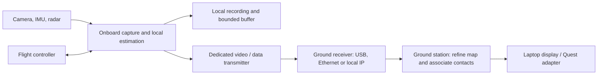

# Room mapping chain and deployment without a hotspot

**Saved-footage follow-up and pause:** a later bounded test replaces only the
known streaked frame. All three selected Large couch windows then pass the same
screens (40 selected poses over 49.02 s). A broader sharpness/feature heuristic
does worse. See the [replay and checkpoint](../Mapping/examples/selection-followup-20261003/README.md).
Work pauses at Evan's request after saving this result. The earlier results below
describe the original input selection; no physical-accuracy gate has been passed.

Evan clarified the future goal on 3 October: a deployable drone that can
eventually fly autonomously and relay information without joining someone's
Wi-Fi/hotspot. Autonomous flight is a separate workstream; Herman owns flight
and IMU integration. This experiment covers recorded mapping/CV and a software
boundary for future communications, not flight commands.

## Compute and communications decision

Keep three independent responsibilities: onboard flight/local sensing, a
replaceable drone-to-ground transport, and ground-station interpretation/display.
The current hotspot is a prototype transport. A dedicated drone transmitter and
ground receiver can replace the infrastructure connection. Some direct digital
links still use Wi-Fi-derived radios; deployment independence does not require
banning that underlying radio technology.

The flight-controller connection shown is a future architecture boundary. This
mapping code does not command it. Onboard pose, obstacle handling and link-loss
behavior must be validated before autonomous flight; guessed room completion
is operator context, not collision geometry. IMU integration requires clock
synchronization and camera/IMU calibration, not simply adding sensor values.

| Deployment approach | Onboard work | Link needs | Ground station |
| --- | --- | --- | --- |
| Direct video/data link | Capture, timing, encoding, local recording; flight/local estimation separately | Enough measured throughput for the selected video stream and telemetry | Heavy AI and map refinement as now |
| Compact scene relay | Local tracking and mapping, contact estimation, recording | Smaller pose/contact updates and occasional map changes | Display and optional refinement from selected images |
| Temporary link outage | Continue the independently validated onboard tasks and recording | None during outage; resume with freshness/revision checks | Preserve static map, visibly age/remove live pose and contacts |
| Entirely disconnected | All sensing/flight work onboard | Download on return | No live operator updates while disconnected |

Quest only needs a connection to the ground station. It need not join the drone
radio network. Its local display link can be selected separately. The existing
Unreal stationary-people bridge still needs a room-map adapter and hardware
acceptance; moving-drone registration is not implemented.

### Measured data volume, not a radio benchmark

The 658 JPEG couch frames total 34,378,526 bytes over 55.020797 seconds: roughly
**5.00 Mbit/s** of saved-image payload at capture speed. A compressed video codec
could change that substantially; H.264 was not encoded or measured in this test.
Do not size the video radio from a telemetry baud rate.

The new compact layout snapshots are **3,429–4,858 bytes**, or **1,335–1,780 bytes**
with zlib compression. The uncompressed payload alone would take 0.48–0.67 s at
an assumed 57.6 kbit/s effective rate. That assumption is not a SiK performance
claim and excludes framing, error correction, retries and competing traffic.
An actual radio must be tested for payload, latency and loss in the deployment.
[PX4 documents dedicated telemetry radios](https://docs.px4.io/main/en/telemetry/sik_radio)
as a flight-controller/ground-station communication option; they are not an
automatic replacement for a high-bandwidth camera feed.

Those compact packets were produced on the Mac. The Pi cannot send information
it has not computed: a low-rate-only uplink requires onboard mapping, or sparse
images and much slower ground-based reconstruction. There is no measured onboard
compute/power/thermal budget for this DA3 chain yet. Select compute and radios
after measuring that budget, not from laptop RAM or advertised radio range alone.

The transport adapter should preserve capture timestamps, source/map/revision
IDs, units and scale state, calibration IDs and tracking state. Prioritize fresh
poses/contacts over map chunks/video, bound queues, and never replay delayed
contacts as current after reconnect. Large map data can be versioned/chunked;
map changes and camera poses must remain in the same coordinate frame. These
are requirements for the next adapter, not newly implemented live behavior.

## What this experiment established

[Open the comparison](../Mapping/examples/room-chain-20261003/index.html).
DA3 and SegFormer can be chained locally with geometric fitting and removable
completion layers. The Mac ran all five new bounded model jobs at 504 resolution.
Large's first couch join passed the unchanged overlap screen; the final join did
not. Base's first join failed. Neither result is a validated complete map.
The wider sweep remains unstable with both Small and Large. A flatter floor or
more complete drawing does not resolve weak camera alignment.

Small floor-gap filling is the most defensible completion to keep experimenting
with. A rectangular envelope demonstrates a coherent-looking guess but its
hidden boundaries have no support. Keep it optional. Wall labels and repeated
plane fragments also need checking: furniture can be mislabeled as architecture.
The algorithm currently fits up to four wall patches, not four verified walls.

DA3-Streaming, VGGT-SLAM and SceneScript were audited at pinned source revisions.
They were **not inference-benchmarked** on this Mac. CUDA calls/dependencies stop
their unmodified paths here; source evidence and the failed capability probe
are in the [bundle](../Mapping/examples/room-chain-20261003/README.md). Test them
on a compatible team GPU machine or scope an explicit port. A 5000-series name
alone does not establish supported dependencies, available VRAM or speed.

## Next experiments and fine-tuning decision

1. Keep a fixed recording set and current screens. Test better keyframe
   selection, rectification/FOV handling and joint camera alignment before
   relaxing acceptance. The existing source streak remains a useful failure case.
2. Run a pinned CUDA SLAM baseline on the same footage. Compare retained
   trajectory, overlap/loop consistency, latency and memory; do not judge only
   render appearance. Feed any resulting poses through the existing pose boundary.
3. Check a simple room against measured distances and independent reference
   poses. Use separate rooms for development and evaluation. Add IMU when Herman
   provides synchronized calibrated data.
4. Replay incrementally into the ground-station display, then simulate bandwidth,
   loss, delayed packets and reconnects before connecting real radios/Quest.
5. Consider fine-tuning only after identifying a repeatable model error. For
   semantic errors, collect corrected wall/floor/door masks from this camera.
   For depth, collect reference depth/poses and metric information. For completion,
   collect full-room layouts with partial observations. Split by room/session,
   not adjacent frames, to avoid optimistic leakage.

No training data with physical ground truth exists for these room captures yet.
Fine-tuning on our own AI guesses would reinforce errors. The immediate priority
is alignment, evidence quality and measured evaluation; a heavier model already
fits, but weight size alone does not solve those gaps.
