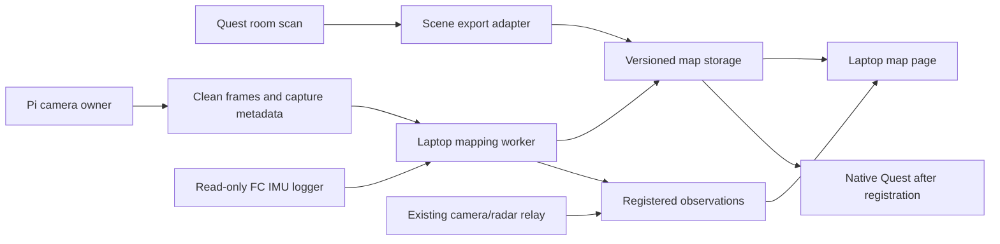

# ADR-001: A saved room map and live sensor overlay

**Status:** Rough operator-map scope confirmed; a reliable room map remains unvalidated. The brighter 20 ms Pi pass now retains one 17.7-second camera path after initialization. Loop repeatability and physical accuracy remain pending. A separate AI room draft includes tentative surfaces and labels. The 12 fps recorder passed stationary and sideways timing checks; IMU fusion is planned.

**Date:** 25 September 2026; use case revisited 1 October 2026.

**Decider:** Evan/team after the existing-hardware experiments.

**Current implementation:** [CONTEXT.md](../CONTEXT.md).

**2 October clarification:** Evan also wants a rough AI picture when confidence
is low. The new `Mapping.ai_room_draft` viewer shows wider-room predictions,
weak surfaces and tentative semantic labels linked to source images. It remains
an explicit hypothesis with unknown scale and unverified alignment. Existing
operator placement checks are unchanged; the draft does not establish drone or
people positions. See the [current runbook](../Mapping/README.md).

**M5 follow-up completed:** [Mac benchmark and overlapping-window experiment](mac-mapping-2026-10-01.md)
implements the first reference-data replay and a conservative stitching prototype
from the next-step sequence below. DA3 Small fits comfortably in the tested
configuration. The stool fragment extends twice, but continuous room mapping still
fails the current checks. These results supersede the proposed-only status of
those two experiments; VIO and upstream CUDA systems remain unimplemented.

## Confirmed first-version scope — 1 October

**Latest quick-scan result:** the operator comparison now tests timestamp-bounded
2/5/10-second windows from two recordings. Stool/floor patches are recognizable,
but their short-window poses change when more views are added. The room sweep
has insufficient floor support at 2/5 seconds and unstable geometry at 10 seconds.
Semantic object identities also fail, so the sketch retains generic object regions
and source images. No reliable full-room scan duration has been established.
See `Saved/MappingResearch/quick-scan-20261001/operator-comparison.html` and the
[current runbook](../Mapping/README.md). Work while the Pi is unavailable follows
the software sequence below.

**Earlier joint depth/pose trial:** DA3 Small predicts depth and camera poses on the Mac
GPU. A 16-view chair segment produces a recognizable coarse stool/floor cloud;
an overlapping shifted batch changes the shared camera path by 1.9% of its spread
after similarity alignment. This is input sensitivity, not measured accuracy.
Longer coverage has larger image reprojection errors. Inspect
`Saved/MappingResearch/da3/comparison.html`; exact provenance and reproduction are
in [Mapping/README.md](../Mapping/README.md). A better room-level capture remains
necessary for validating performance with our camera.
The local recorder now supports configurable rates up to 24 fps, defaulting to
12; deployment and a bounded throughput test await the offline Pi's reconnection.

**Implementation update:** the optional ORB-SLAM3 laptop build and recording replay
are implemented; [build/replay notes](../Mapping/orb/README.md). Three trials on
the two calibrated chair recordings briefly initialized but discarded their maps.
The dashboard now also displays an explicitly separate, repeatability-screened
offline fragment: 58 camera views and 3,357 visual landmarks. Its coarse display
does not establish room walls, free space or people placement. Higher-rate capture
and successful tracking validation remain pending; the Pi still saves 3 fps.

Evan's priority is **a rough room layout with approximate drone/people positions**.
Fine object detail and a detailed mesh are unnecessary. Use a coarse top-down
representation of supported room boundaries and large obstacles, a camera/drone
position and heading, and fresh people observations in the same frame. Show
unobserved or uncertain regions explicitly. Sparse feature gaps do not establish
free space. Autonomous navigation is outside this first milestone.

The chair captures test tracking/geometry and should not drive the product toward
object modelling. The latest retake still gives inconsistent full camera paths
across builds, so reducing visual detail alone will not make it a usable room map.
The earlier continuous-tracking experiment selected ORB-SLAM3 on the laptop,
preserving existing capture/calibration/storage/viewer components. It is
implemented as the experiment above, not a validated replacement. Its sparse landmarks need
an additional, validated coarse-geometry stage to represent room boundaries.

Existing recordings save 3 images/second. Use them for initial replay only; obtain
higher-rate timestamped input before judging continuous tracking under motion.
Establish scale and sensor registration before placing metric radar observations
on a monocular map. Camera/IMU fusion remains conditional on connecting and
calibrating the FC IMU. Stereo/depth with RTAB-Map is the alternative if the
existing camera cannot support useful room coverage and tracking.

The historical rankings and numerical targets below are proposals, not accepted
accuracy requirements for this rough-map use case. Judge the next trial by a
coherent room layout, a stable return to the starting area, and approximate people
positions verified at known locations; point count and chair surface detail are
secondary.

**Latest:** [Experiment ledger](mapping-experiments-2026-09-25.md) documents
separate inferred surfaces, live depth preview, optional localization in a saved
map, Pi feature benchmarks and deployed capture controls. Continuous map expansion
and metric validation remain pending; later entries supersede the proposed-only
status of those experiments below.

## Next software experiments — proposed, not implemented

The immediate gap is maintaining one useful coordinate frame as new views arrive.
Our current DA3 windows are separate estimates with independent origin, orientation
and scale. A recognizable surface patch alone cannot place a moving radar contact.
The next deliverable should be **a replay that grows one coarse map, shows camera
pose and uncertainty, and withholds contacts whenever registration is unreliable**.

1. **Establish an independent reference while the Pi is unavailable.** Replay the
   RGB input of a short [TUM RGB-D room sequence](https://cvg.cit.tum.de/data/datasets/rgbd-dataset),
   reserving its measured depth and motion-capture trajectory for evaluation.
   Compare 2/5/10-second prefixes, observed coverage, depth/pose error, retained
   tracking and total processing time. Report any similarity alignment separately;
   fitting away monocular scale must not be reported as recovered metric scale.
   This separates model limitations from our footage/calibration problems.
2. **Test overlapping windows against that reference.** Retain a map frame and
   align new windows using shared views and supported geometry. Reject poorly
   constrained fits, particularly near-stationary or rotation-only motion; preserve
   unknown regions. Use revisit constraints to test drift. This is an experiment,
   not a claim that independent batches can simply be concatenated.
   [DA3-Streaming](https://github.com/ByteDance-Seed/Depth-Anything-3/tree/main/da3_streaming)
   supplies chunk alignment/loop-closure code to study, but its official pipeline
   is not a complete SLAM system. The checked source uses CUDA-specific calls and
   `faiss-gpu`; our working DA3 Small MPS runner does not establish streaming Mac
   compatibility. Start with the existing runner rather than assume a drop-in install.
3. **Prepare visual-inertial localization for the later IMU.** Evaluate
   [OpenVINS](https://github.com/rpng/open_vins) on its supported
   [EuRoC/TUM VI recordings](https://docs.openvins.com/gs-datasets.html) before
   connecting the FC. It estimates motion from camera tracks plus IMU samples;
   persistent room-map relocalization and surface mapping remain additional work.
   Camera/IMU [time, mounting and noise calibration](https://docs.openvins.com/gs-calibration.html)
   are required for a useful scale/orientation estimate. Our existing
   `Mapping.pose_bridge` accepts the resulting poses after validation; no live
   fusion exists yet. ORB-SLAM3's inertial mode is another candidate using our
   existing build, but the monocular replay failures remain unresolved.
4. **Reduce observation time through coverage, not a fixed timer.** Select sharp,
   overlapping views that add floor/wall/doorway evidence. Propose the next useful
   view and keep an image-linked landmark summary when a metric layout is not yet
   supported. Stop criteria need benchmark evidence; a 360-degree rotation or a
   generic language-model room guess does not establish unseen geometry.

Alternatives if these experiments do not meet the use case:

| Software / approach | Gap it addresses | Practical condition |
| --- | --- | --- |
| [MASt3R-SLAM](https://github.com/rmurai0610/MASt3R-SLAM) | Learned reconstruction with continuous tracking and map optimization | Official setup uses CUDA and was primarily tested on Ubuntu; consider when an NVIDIA machine is available, not a demonstrated Mac option |
| [RTAB-Map](https://introlab.github.io/rtabmap/) with stereo/RGB-D | Direct metric depth and a persistent pose graph | Requires suitable depth hardware and payload/power/calibration evaluation |
| Image-linked landmark graph | A quick operator summary: doorway, obstacle, observed direction, unknown space | Useful intermediate output; it cannot supply metric people placement until localized |

When the Pi returns, deploy the prepared 12 fps capture update and measure actual
throughput/drops/exposure before a short room sweep. Later collect synchronized
camera/IMU data and known-location checks for the camera and radar separately.
Better labels can improve communication after stable geometry is established;
the current SegFormer candidates must not be treated as verified object identity.

## Recommendation

The user clarified that the first version should work **without Quest**, with
Quest optional later. Start with a **Pi-camera recording processed on the laptop**.
The implemented [baseline workflow](../Mapping/README.md) uses CPU COLMAP for
offline sparse reconstruction and a browser viewer. It establishes image quality,
parallax and recoverable geometry before live SLAM/VIO integration. Follow with
the existing flight-controller IMU after timing and calibration are characterized.

The original Quest-first layout recommendation and weighting below remain useful
as an options comparison; they no longer determine implementation order. A Quest
scan is an optional geometry/reference source, with explicit map alignment.

Use the laptop's `GroundStation` as the place to store and display maps. Keep
the map source replaceable so a later stereo/depth camera can supply geometry
without replacing the UI or people pipeline. If the priority is mapping a room
the operator cannot enter, the Quest scan is only a development baseline;
camera/IMU or depth on the drone must meet that requirement independently.

The broader live mapping/fusion design below remains a plan. The camera recording,
offline reconstruction and `/map` viewer subset is implemented. The first actual
room walk saved 236 images without drops. Its standard result was a partial
56-camera/245-point map; XFeat improved this to 224 cameras/7,865 points. On the
second walk, XFeat recovered all 97 cameras and 9,149 points in 34.4 seconds.
See [ADR-002 for measured results and the feature/depth strategy](mapping-quality-strategy.md).
Useful room coverage and metric accuracy remain unverified. Scores use the original room-layout assumption; the confirmed
headset-independent requirement changes that ranking's applicability.

## What “room mapping” includes

| Deliverable | Meaning | What does not establish it |
| --- | --- | --- |
| Rig localization | Where the camera/drone is, with orientation, in a stable room frame | Integrating accelerometer readings or holding position at launch |
| Room geometry | Walls, floor, openings and known obstacles with scale and provenance | A cloud of sparse visual features or LD2450 people tracks |
| Persistence | Save geometry and estimator state; reopen and register/relocalize later | A screenshot or an in-memory viewer |
| Live overlay | Fresh sensor observations transformed into that same frame | Plotting two independently scaled coordinate systems together |

The camera must observe a surface to map it. The LD2450 supplies a small target
list, not a laser scan or raw radar imagery for reconstructing walls. Mapping
the room and detecting someone behind a wall are separate experiments.

## Approaches and trade-offs

| Approach | Existing hardware / additional cost | What it produces | Main limitation | Best use |
| --- | --- | --- | --- | --- |
| **A. Quest scene / MRUK** | Existing compatible Quest; no new sensor | Room floor/wall/object geometry and headset tracking | Person must scan the room; does not localize the drone; export/registration still needed | Fastest plausible complete room-layout baseline |
| **B. IMX219 + ORB-SLAM3 monocular** | Existing Pi camera + laptop; no new sensor | Camera trajectory and sparse feature map | Unknown scale, texture/motion sensitivity; no direct dense walls/free space | Cheapest direct test of the drone camera |
| **C. IMX219 + existing FC IMU** | Existing sensors, if raw data are usable; substantial integration time | Metric visual-inertial pose and sparse structure | Sensor timing, units, noise and rigid transform calibration; geometry remains a separate task | Longer-term moving-drone localization |
| **D. Stereo/RGB-D + RTAB-Map** | Borrow or buy depth hardware; added mass/power/USB load | Metric depth, pose graph and exportable map geometry | Payload and image/depth limits; still needs odometry, calibration and validation | Most direct upgrade for useful drone-observed room geometry |
| **E. 2D lidar + SLAM Toolbox** | New scanner and mount | Metric horizontal occupancy map and pose graph | One scan plane; roll/pitch and height changes violate the simple planar setup | Strong floor-plan experiment on a level handheld/cart rig |
| **F. Learned dense SLAM, e.g. MASt3R-SLAM** | Reuse camera; supported CUDA GPU compute not confirmed | Denser reconstruction from RGB observations | Different compute stack; scale/geometry need external checks; upstream/checkpoint terms need review | Offline comparison if a suitable GPU is already available |

**A — reuse code already present.**
`Source/HandoffQuestHUD/Private/WallhackNavigationProviders.cpp` already loads
MRUK scenes, requests room capture, reads floor polygons, wall/door geometry and
object volumes, and queries environment depth. There is no implemented export
from that code to the laptop. Meta documents device scene loading and JSON
save/load, so an export adapter is a plausible small next slice. Confirm the
installed plugin API rather than assuming the newest examples compile unchanged.
Saving geometry is separate from restoring physical registration after a restart.
[Meta MRUK features](https://developers.meta.com/horizon/documentation/unreal/unreal-mr-utility-kit-features/).

The desktop scene provider currently returns a deterministic test room. That
preview is synthetic and must not be exported or presented as a scan of our room.

**B/C — pose first; don't promise a floor plan.** ORB-SLAM3 supports monocular,
stereo, RGB-D and inertial configurations, with loop closing and map reuse.
Its atlas load/save settings exist in the implementation. A browser point-cloud
export needs an adapter; a saved atlas is not a ready-made wall mesh.
[ORB-SLAM3](https://github.com/UZ-SLAMLab/ORB_SLAM3),
[atlas persistence code](https://github.com/UZ-SLAMLab/ORB_SLAM3/blob/master/src/System.cc).

OpenVINS is a useful candidate when the experiment is specifically about
visual-inertial pose. Its core estimator is not a complete persistent room-map
product; the project lists additional loop-closure/map-export integrations.
ROS-free integration is documented. Compare it with ORB-SLAM3 mono-inertial
on the same calibrated recording, rather than attempting both live integrations
at once. [OpenVINS](https://docs.openvins.com/),
[ROS-free installation](https://docs.openvins.com/gs-installing-free.html).

The current FC utility uses MSP, sequential polling and host `time.time()`;
it also sends `MSP_SET_MOTOR` in its loop. Its derived pose is not a VIO input.
Build a separate read-only logger for accelerometer/gyroscope measurements with
known units and timing. Camera/IMU timestamp errors and extrinsic calibration
are material estimation problems. Adding a BNO085 alone does not solve them;
select an IMU by usable gyro/accel reports, timestamps, noise, mounting and
driver support, not by whether it produces a fused orientation quaternion.
[OpenVINS calibration](https://docs.openvins.com/gs-calibration.html),
[Ceva BNO sensor family](https://www.ceva-ip.com/product/bno-9-axis-imu/).

**D — best candidate if geometry is the bottleneck.** RTAB-Map supports RGB-D,
stereo and lidar mapping; its tooling exports clouds, meshes and 2D occupancy
grids. It still needs actual depth/stereo/scan inputs and a working pose path;
feeding the existing monocular stream does not make it metric RGB-D mapping.
[RTAB-Map project](https://introlab.github.io/rtabmap/),
[export tools](https://introlab.github.io/rtabmap/api/latest/tools.html).

Borrow a RealSense D435i-class unit or a suitable OAK stereo camera before
choosing a flight payload. D435i combines stereo depth and timestamped IMU data;
its RGB camera is rolling shutter even though its depth imagers are global
shutter. Confirm exact OAK model/revision and IMU presence. Compare complete
mount/cable mass, power, depth coverage at room distances and software support;
camera purchase price alone misses the integration cost. No price or stock
assumption is used in this decision.
[D435i specifications](https://www.realsenseai.com/products/depth-camera-d435i/),
[Luxonis hardware comparison](https://docs.luxonis.com/hardware/platform/comparison/vs-realsense).

**E — strong 2D mapping, weaker fit for this aircraft.** SLAM Toolbox supports
2D scan matching and serialized pose graphs for later mapping/localization.
That is relevant to a level scanner; it does not establish suitability for a
tilting quadcopter or provide a full 3D obstacle model.
[SLAM Toolbox](https://github.com/SteveMacenski/slam_toolbox).

**F — benchmark, not the initial runtime dependency.** MASt3R-SLAM offers dense
SLAM from learned reconstruction priors. The supplied install path uses CUDA
PyTorch and compiled components. We have not established a compatible GPU or
Pi/Hailo deployment path. Try the same recorded walk offline if compute is
available; validate dimensions independently before using it for metric overlays.
[MASt3R-SLAM authors' repository](https://github.com/rmurai0610/MASt3R-SLAM).

## Weighted comparison

For the assumed **first live room layout**, weights are: room geometry **30%**,
reuse of confirmed equipment **25%**, speed to a useful prototype **20%**, path
to drone operation **15%**, and integration simplicity **10%**. Score 1–5,
higher is better; the total is a weighted average, not benchmark accuracy.
The Quest score assumes a compatible headset and build machine are available.

| Approach | Geometry | Reuse | Speed | Drone path | Simplicity | Total / 5 |
| --- | ---: | ---: | ---: | ---: | ---: | ---: |
| A. Quest scene | 5 | 5 | 4 | 1 | 4 | **4.10** |
| D. Stereo/depth + RTAB-Map | 5 | 1 | 4 | 4 | 3 | **3.45** |
| C. Camera + existing FC IMU | 2 | 5 | 2 | 5 | 1 | **3.10** |
| B. Camera-only ORB-SLAM3 | 1 | 5 | 3 | 3 | 3 | **2.90** |
| E. 2D lidar | 4 | 1 | 3 | 2 | 3 | **2.65** |
| F. Learned dense SLAM | 4 | 2 | 2 | 2 | 1 | **2.50** |

This ranking explains the sequence, not a permanent sensor selection. A wins
the early operator demo but fails the requirement to independently explore an
unvisited room. B remains worth a short experiment because it cheaply reveals
whether our existing images track well. If onboard mapping of unseen rooms is
the immediate priority, exclude A as the mapper and compare C against D;
if a CUDA GPU is already available, reassess F's reuse and speed scores.

## Where the live map and saved data should live

**Implemented subset:** `/map` is available in `GroundStation.server` and a
standalone `Mapping.server`. The standalone app binds localhost by default;
explicitly bind the laptop LAN interface when other devices need access. The Pi
records clean images; the laptop copies and reconstructs saved walks, then serves
3D points and camera paths. Native Quest map consumption and sensor overlays are
still proposed. The laptop must be running to serve the viewer.

Start with a top-down view: observed walls/floor, unknown areas, sensor pose and
fresh people/targets. Offer sparse features as a diagnostic layer, clearly
labelled. A 3D viewer can be added after the map source merits it. Keep static
geometry separate from moving contacts; do not bake people into the saved room.



Implemented storage root: `Saved/Mapping/<session_id>/` (already under the repo's
ignored `Saved/`). Use unique session IDs and immutable revision files; update
the active manifest atomically. Retain recordings and checksums for reproducible
comparison. Ignored files are not a backup: explicitly copy/export a session
bundle to the team's chosen durable storage before cleaning the workspace.

The table below is the target format for the broader mapping system. The current
camera baseline writes capture metadata, images, COLMAP reconstruction revisions,
PLY and viewer JSON; it does not yet produce `room.json`, calibrated transforms,
meshes or occupancy grids. See the [runbook](../Mapping/README.md) for actual paths.

| Artifact | Contents |
| --- | --- |
| `manifest.json` | Schema version, map/session/revision IDs, source, capture date, coordinate convention, units, metric-scale status, calibration IDs, backend/version, artifact paths and checksums |
| `room.json` | Floor polygons, wall segments/planes, openings and object bounds; provenance and observed/unknown status |
| `backend/` | Native MRUK scene JSON, ORB atlas or RTAB-Map database; preserve whichever the selected backend needs for reuse |
| `geometry/` | Optional sparse cloud, dense cloud, mesh or occupancy grid; describe resolution, origin and height band |
| `calibration/` | Image intrinsics/distortion, sensor transforms, clock model, scale source and sensor-to-map registration |
| `recording/` | Clean images/video with exact frame index/timestamps, optional raw IMU, existing telemetry JSONL |
| `evaluation.json` | Measured distances, errors, tracking/loss statistics, latency method and hardware/software inventory |

Expose a bounded map manifest/status separately from large geometry downloads.
A later additive telemetry extension can reference `map_id`, `revision`, pose
timestamp/clock, coordinate frame, scale state and tracking status. Do not attach
the complete point cloud to every 10 Hz people packet. On loop closure, publish
a consistent revised map/pose transform so walls and overlays move together.

No cloud service is needed initially. If off-LAN access becomes necessary, choose
an authenticated tunnel/service separately; the existing server is a LAN tool.
An exported map bundle can be shared without keeping the live sensor server up.

## Registration and motion: the integration work that cannot be skipped

Keep existing `sensor_reference_2d` data unchanged. For a stationary rig, measure
the configured sensor origin and forward axis in the room map, then check a third
point to catch scale/mirror errors. Reuse the concept of the current Quest
two-point placement, but save/validate a distinct map-registration record.
An exported Quest JSON file does not automatically localize a later headset
session, a laptop, or the drone.

For a moving rig, the transform chain is conceptually:

```text
sensor measurement -> rigid sensor/camera transform
                   -> camera pose at measurement time
                   -> room-map registration -> laptop/Quest display
```

Use calibrated 3D pose internally; project to the floor only with a declared
height/floor assumption. LD2450 has no elevation, so camera 6DoF tracking does
not remove the radar's tilted-flight ambiguity. Do not silently carry over the
stationary bearing-matching implementation to a moving rig.

Pose interpolation requires a common or explicitly synchronized time basis.
Pi sensor time, FC time, laptop receive time and Quest time are different domains.
Preserve capture timestamps through Wi-Fi transport. On relocalization/reset,
require compatible map/calibration/reference IDs. A saved map may remain visible
when tracking is lost, but current world pose/contacts must become unavailable;
sensor-local observations may still be shown with that label.

## Existing-hardware experiments and decision gates

The Pi camera inventory, deployment and a short physical capture/download check
are complete. The room-mapping and sensor-fusion experiments below remain pending.
Use a hand-carried rig with props removed. Do not start the combined IMU/motor
utility as a convenient logger. The user's later authorization and authenticated
SSH connection superseded the pasted handoff's restriction on agent-run Pi commands.

### 0. Inventory and preserve the stationary baseline

Record Pi checkout commit, camera/lens/resolution/rotation, FC board/firmware and
serial interface, Quest model/plugin version, laptop OS/CPU/GPU, mount transforms,
available storage and measured power/payload. Recheck Hailo only if fitted.
Confirm radar left/centre/right with tape measurements; retain the working mirror
until evidence says otherwise. Record empty, moving-person and stationary-person
cases separately. Through-wall behavior remains its own controlled test.

Existing commands, **not new mapping commands** (from the repository root;
substitute the actual venv path on the Pi):

```sh
# Pi: reuse the running station if present; only start one camera/UART owner.
../.venv/bin/python SensorRig/CV/pi_camera_stream.py --radar --quest-port 8765

# Laptop, with GroundStation requirements installed:
python -m GroundStation.server --pi-http http://larp-pi.local:8766 --record Saved/mapping-baseline.jsonl
```

The relay recording contains telemetry, **not clean image frames or raw IMU**.
It cannot by itself run visual SLAM. Use a new output name for each recording.

### 1. First saved room and overlay

On the Quest build machine, run the existing native build/tests, scan an accessible
test room and inspect the existing MRUK provider output. Implement the scene
export/import adapter and `/map` view. Save one room, restart the laptop service,
reload it and re-register the stationary sensor. A manually measured outline may
exercise the display/storage first, but label it as manually authored.

Compare at least three room dimensions and three known sensor-relative floor
points. Show camera-estimated and radar-matched contacts separately from
unclassified radar targets. Check that map geometry survives a sensor disconnect
while stale people disappear. This validates a persistent overlay, not drone SLAM.

### 2. Camera-only mapping from real recordings

Add a bounded recording/stream branch **inside the existing camera owner**, before
annotation. Obtain image and metadata from the same captured request. Preserve
sensor timestamp, exposure, frame sequence, camera generation and host receive
time; the current `capture_array()` followed by `time.monotonic()` is host-side
timing, not an exposure timestamp. Document conversion between clock domains.
[libcamera control definitions](https://github.com/raspberrypi/libcamera/blob/main/src/libcamera/control_ids_core.yaml).

Calibrate the actual processed image, including crop/resize and 180° rotation,
for focal length, principal point and distortion. A presumed HFOV or single
person-height estimate is insufficient. Record a slow, textured 10–20 m closed
walk with translation/parallax, a pause, a blank wall, a faster turn and a moving
person. A yaw-only rotation cannot triangulate a room.

Run ORB-SLAM3 monocular offline on the laptop, then from the timestamped stream
if the offline result is usable. Record initialization, tracked-frame fraction,
loss/recovery, loop correction and resource use. Apply scale from one independently
measured baseline only for the labelled scaled experiment; evaluate other distances
without refitting scale to each one. Save/reopen the backend map and test localization
from a new viewpoint. Do not present sparse points as measured free-space boundaries.

### 3. Qualify FC IMU data before a VIO trial

Create a separate checksum-validating read-only MSP logger, or use a supported
timestamped FC stream after verifying firmware. Measure delivered rate, repeated
samples, gaps, buffering and clock behavior. Sequential attitude/raw-IMU polling
and a sleep interval do not establish the sensor's sampling frequency. Aim for
a characterized raw gyro/accel stream around 100–200 Hz or the chosen estimator's
documented needs; this is a test target, not a guarantee from the current hardware.

Confirm units/axes and gravity, sensor noise, camera-to-IMU transform, exposure
timing and clock offset/drift. Use well-lit motion with acceleration/rotation to
make scale and biases observable. Compare mono-inertial ORB-SLAM3 or OpenVINS
against the camera-only recording and measured loop. If timing cannot be made
credible, stop tuning around it and evaluate a synchronized sensor package.

### 4. Evaluate an upgrade only against the same room/test

If camera tracking works but wall geometry is poor, borrow stereo/depth and run
RTAB-Map on the laptop. If camera blur/timing is the failure, investigate a
synchronized global-shutter camera/IMU package. If the goal becomes a level 2D
survey, trial lidar. Use the same path, dimensions, lighting and moving-person
cases; compare geometry, pose, reload behavior, payload/power and engineering cost.
Hailo should not be assumed to accelerate SLAM optimization merely because it can
run a detector.

### Proposed acceptance targets

These are starting targets for a room-overlay prototype, **not flight-navigation
requirements or achieved results**. Record failures as well as averages.

| Check | Initial pass criterion |
| --- | --- |
| Layout scale | Three independently measured dimensions each within 10%; target tighter accuracy after baseline |
| Room registration | Three known floor points within 0.25 m after one registration; log sensor error separately |
| Moving camera pose | ≥95% tracked frames on the easy loop; record drift before and after loop correction; target ≤0.3 m end-position error on a 10 m loop |
| Persistence | Restart and recover the same map revision; demonstrate either valid relocalization or explicit re-registration, with no silent origin reset |
| Freshness | Existing contact expiry still works; pose loss removes world placement rather than freezing a moving rig |
| Live latency | Target ≤250 ms capture-to-display p95; use synchronized clocks or a physical visual timing test, not subtraction of unrelated device clocks |
| Map honesty | Unknown space stays unknown; moving people do not become permanent walls; arbitrary-scale maps do not label coordinates as measured metres |

The immediate next physical test is **a brighter, slower scan of textured
furniture**, compared against the partial first room walk in the
laptop viewer using [the implemented setup](../Mapping/README.md). Quest import,
wall geometry, full-rate VIO data, metric alignment and live localization follow
that result; their availability must not be inferred from the sparse-map viewer.
