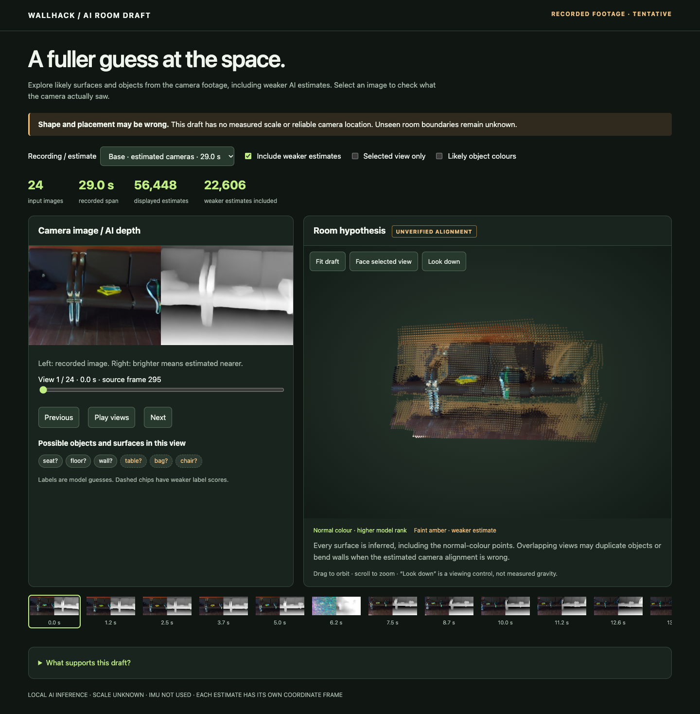

# Small, Base and camera-pose conditioning

Open [index.html](index.html) locally after cloning. The four saved estimates,
source images, relative depth and tentative labels work offline, without a Pi or
model download. Select **Base · estimated cameras** to inspect the strongest
image-alignment result in the first, wider-view comparison. The corrected camera
encoding follow-up is in [centered.html](centered.html); its crop is narrower.



## First comparison: original principal point

Same 24 couch images, rows 294…639 at stride 15, covering 28.99 seconds. All four
use the reviewed lens correction, 504×378 processed images and the camera decoder.
The coloured-streak image is retained in slot 6. No views were replaced after
seeing the results. These are visible-scene drafts, with no measured scale or IMU.

| Variant | Adjacent image error ↓ | Revisit image error ↓ | Second model call | Sampled Metal peak |
| --- | ---: | ---: | ---: | ---: |
| Small, estimated cameras | 3.15 px | 2.99 px | 1.69 s | 3.17 GiB |
| Small, supplied ORB poses | 3.65 px | 5.16 px | 2.54 s | 3.19 GiB |
| Base, estimated cameras | **1.74 px** | **1.93 px** | 12.83 s | 5.41 GiB |
| Base, supplied ORB poses | 3.53 px | 2.54 px | 2.81 s | 6.41 GiB |

Base reduces the adjacent image discrepancy by about 45% against Small here.
With the original off-center K, the ORB-guided bridge does **not** improve image alignment. Its depth
consistency improves in some comparisons, but neither metric validates physical
dimensions. Both renders still have overlapping edges and incomplete surfaces.
This supports trying Base for offline visual drafts, but does not establish
a general winner. The original-principal conditioning result has the model-input
limitation described below; the guided bridge remains experimental. Do not promote either to navigation.

Timings are the second of two model calls in each process, on an M5/24 GB Mac.
They exclude loading, preprocessing, writes and labels. Compilation/cache/system
load affect them; these are not live camera FPS or a stable speed ranking. Original
first-call and pipeline times are preserved in `results/*.json`. In the isolated
reproduction run, second calls were 1.00 / 0.98 / 2.40 / 2.32 s respectively,
with identical output arrays; see [reproduction measurements](results/reproduction.json). Metal sampling
can miss brief allocations and overlaps CPU memory; do not add them together.

The [comparison](results/comparison.json) uses identical mutual SIFT ratio matches
for every model, without per-model confidence filtering. It measures median
projection discrepancy per pair, then the median across 23 adjacent pairs or
three fixed nonadjacent revisit pairs. It also reports symmetric depth difference
at the matched pixels. Invalid projections are counted; only correspondences
valid for every variant are compared. Repeated textures, occlusion and moving
objects can affect matches. The revisit images are not exact physical returns.
This differs from the earlier confidence-filtered diagnostic shown inside the
viewer's disclosure; do not compare their numbers directly.

## Follow-up: centered camera encoding

Inspection of the pinned upstream `model/utils/transform.py` found that the
camera encoder uses focal lengths but omits principal-point offsets, while its
decoder fixes the principal point to W/2,H/2. Our reviewed K is substantially
off-center. The original-K experiment therefore cannot settle whether correctly
conditioned depth helps.

The second experiment centers K at (320,240) before the official resize, using
OpenCV alpha=0 rectification plus a 1% focal margin. Focal lengths rise from about
793 to 1,469 pixels: this is a substantial crop, not added detail or coverage.
All output pixels remain supported; camera optical-axis orientation is unchanged.
The same 24 source rows were selected before rerunning all four variants.

| Centered variant | Adjacent image error ↓ | Revisit image error ↓ | Second model call |
| --- | ---: | ---: | ---: |
| Small, estimated cameras | 4.62 px | 14.57 px | 0.96 s |
| Small, supplied ORB poses | 10.28 px | 14.40 px | 0.94 s |
| Base, estimated cameras | 5.90 px | 11.75 px | 2.35 s |
| Base, supplied ORB poses | 5.69 px | 9.36 px | 2.32 s |

[Centered results](results/centered-comparison.json) support 20/23 adjacent pairs
and all three revisits. Base guidance modestly improves its own image check, but
Small guidance does not. Base improves some depth-consistency measures; none are
physical accuracy. Compare variants **within** each image group: cropping changes
features and pixel magnification, so the two tables are not a controlled direct
accuracy comparison. Neither experiment justifies a production mapping change.
Next: investigate calibration/pose consistency and a camera rectification that
preserves more field of view before attempting a larger model or a room handoff.

## What conditioning changes

The bridge converts ORB's camera-to-world position/quaternion to OpenCV
world-to-camera transforms. It requires retained poses in one map, matching
image/timestamp/calibration provenance, and a recording-reviewed calibration.
The first diagnostic uses the original K; the corrected follow-up uses centered
K and a narrower field of view. The official input processor resizes images and K
together. All remapped pixels in this example are in bounds.

The model gets first-camera-relative poses, normalized with the official
lower-median distance rule. Its original predicted depth/cameras are saved as
`prediction-model.npz`. For the guided viewer, an explicit all-view Umeyama fit
from input centers to predicted centers supplies a depth scale; exported cameras
and intrinsics are then the supplied ORB poses/K. This uses the official API's
scale direction but omits its optional RANSAC. Camera agreement is imposed and
is never scored as evidence of success. Units remain arbitrary.

Only 24 source JPEGs and their selected ORB poses are packaged. Original row
numbers/timestamps are retained, with the selected tracking timeline rebased to
its first image. This is not a complete ORB replay or a new recording. The full
658-frame recording remains under ignored `Saved/`. No weights are committed.

96 Mapping tests passed. Both viewers passed the browser checks. All four first
comparison variants and the centered Base-guided case were rebuilt from packaged
inputs in the isolated environment with identical depth, confidence, camera,
intrinsics and RGB arrays on this Mac. This is not guaranteed across devices.
See [validation](results/validation.json).

## Reproduce

From the repository root, create/use the Python 3.12 environment described in
the [earlier demo](../room-draft-20261002/README.md). Its pinned requirements also
cover this experiment. The runner supports CPU and Mac Metal; CUDA is not wired
up here. CPU and other hardware were not tested for this comparison.

```sh
python3 -m Mapping.pose_depth_demo verify

# Downloads verified official source/checkpoints. Small ~137 MB; Base ~542 MB.
Saved/MappingResearch/team-demo-venv/bin/python -m Mapping.pose_depth_demo fetch --variant small
Saved/MappingResearch/team-demo-venv/bin/python -m Mapping.pose_depth_demo fetch --variant base

Saved/MappingResearch/team-demo-venv/bin/python -m Mapping.pose_depth_demo run \
  --variant base --device mps --output Saved/MappingResearch/new-base-free

Saved/MappingResearch/team-demo-venv/bin/python -m Mapping.pose_depth_demo run \
  --variant base --device mps --guided --output Saved/MappingResearch/new-base-guided
```

The runner defaults to the centered follow-up. Add `--original-principal` to
reproduce the first diagnostic. Use `--variant small` for the other model.
Every run needs a new output directory.
`--source PATH --model PATH` reuses existing assets only after verifying the
pinned clean source and checkpoint hashes. Inference is fresh; semantic labels
are cached and attached only after the processed RGB hash matches.

To recompute the paired comparison, pass all four resulting `trial/` directories:

```sh
.venv/bin/python -m Mapping.pose_depth_compare \
  --trials PATH_SMALL_FREE/trial PATH_SMALL_GUIDED/trial PATH_BASE_FREE/trial PATH_BASE_GUIDED/trial \
  --output Saved/MappingResearch/new-comparison.json
```

The code also supports the full local recording directly through
`Mapping.da3_trial --variant base --undistort --center-principal --pose-tracking PATH/tracking.json`.
Omit `--pose-tracking` for estimated cameras; select the same images for comparison.

Render/control verification uses `Mapping/tests/check_room_demo.cjs` with
`VIEWER_FILE=Mapping/examples/pose-depth-20261003/index.html`, `PLAYWRIGHT_MODULE`
and optionally `CHROME_BIN`, as in the earlier demo. Select `centered.html` for
the corrected camera-crop viewer. An optional new output
directory exports all four PNGs. Checks cover embedded images, controls, mobile
overflow, no JavaScript errors and no external requests.

Official [DA3 Base model card](https://huggingface.co/depth-anything/DA3-BASE) and
[source](https://github.com/ByteDance-Seed/Depth-Anything-3). Source revision,
Small/Base model revisions and all hashes are pinned in [demo.json](demo.json).
Inputs and renders are published with Evan's prior approval to share the room
photos and reproduction artifacts.
