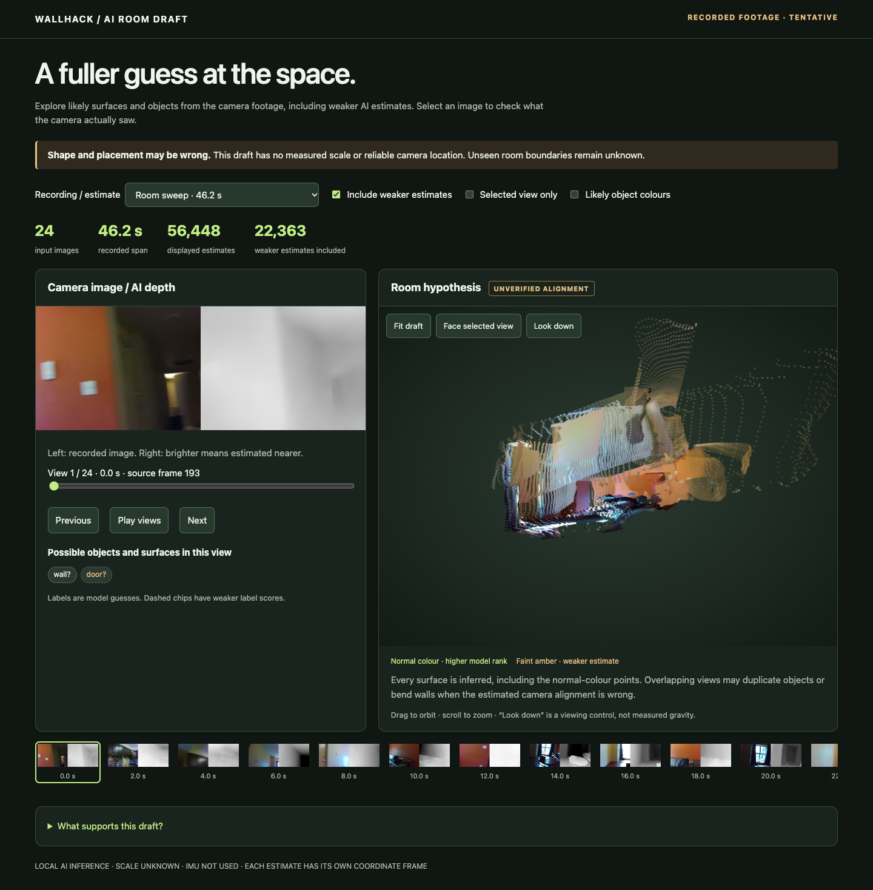
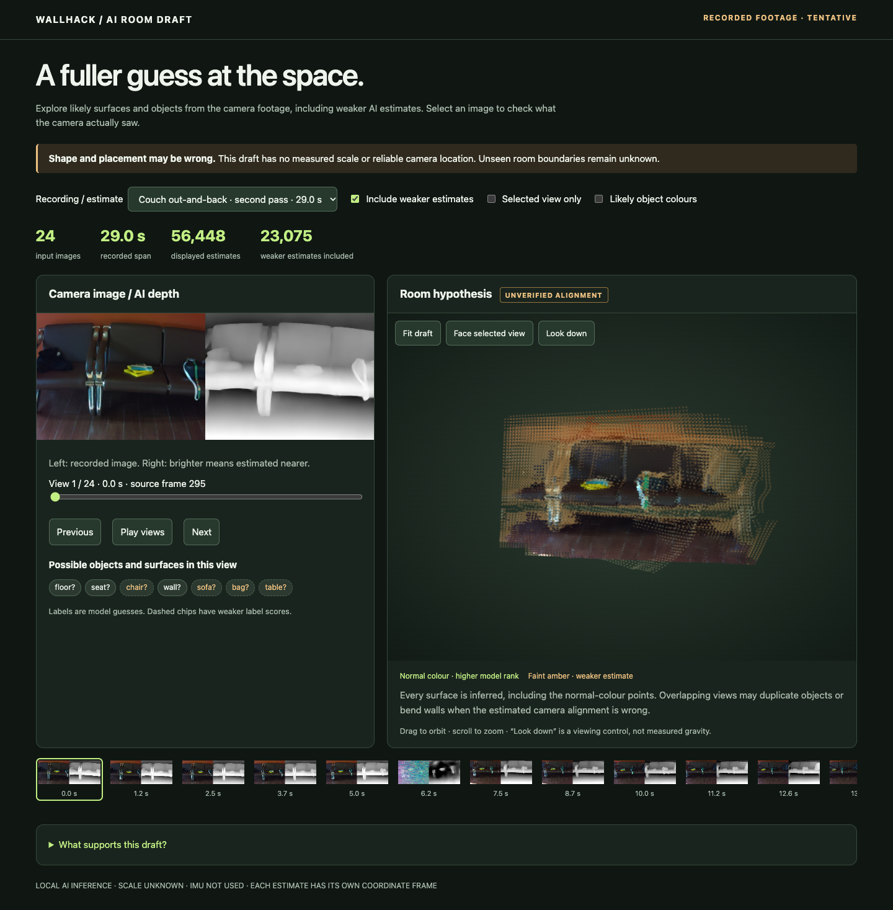

# Recreate the room draft

Open **[index.html](index.html)** locally in Chrome, Edge or Safari after cloning
this branch. It includes images and geometry and needs **no Pi, server, model
download or internet**. GitHub displays HTML source; download/clone it first.



## What made it

**[Depth Anything 3 Small](https://huggingface.co/depth-anything/DA3-SMALL)**,
from ByteDance, predicts depth and camera poses jointly from 24 selected RGB
images. We unproject depth through its predicted cameras into a coloured point
cloud. This is a point-cloud viewer, not a detailed mesh or a generative image.
SegFormer B0 (`nvidia/segformer-b0-finetuned-ade-512-512`) supplies optional object
labels. ORB-SLAM3 separately tracks the camera; it did not create this room cloud.

| Viewer selection | Original input | Span between selected endpoints | Pose estimate |
| --- | --- | --- | --- |
| Room sweep | `20261002T185247Z-037db03f`, rows 192…744, stride 24 | 46.18 s | DA3 camera decoder, MPS |
| Room sweep · alternate estimate | Same 24 images | 46.18 s | DA3 ray head, CPU |
| Brighter sofa and floor pass | `20261002T204006Z-fb75b05e`, rows 120…327, stride 9 | 17.24 s | DA3 camera decoder, MPS |
| Couch out-and-back · second pass | `20261002T213938Z-e3ead809`, rows 294…639, stride 15 | 28.99 s | DA3 camera decoder, MPS |

The first two have **no adjacent pairs with enough verified image matches** in
our local diagnostic. The brighter pass has 23 supported adjacent pairs and
2.21 px median reprojection error, but its camera estimates disagree with ORB.
Recognizable furniture does not establish correct room dimensions or placement.
All four remain unverified, with arbitrary units and independent coordinates.
Faint amber means weaker model rank; it is not a calibrated probability.

The separate dense ORB run retained 213/331 poses, with 17.7 s of uninterrupted
tracking after 9.9 s initializing. That was the brighter pass, not the wide sweep.
These 24-image subsets are **not suitable for reproducing continuous ORB tracking**;
that requires each full recording and reviewed calibration, held locally.

### Latest couch return result



The full 55-second couch recording retained **614/658 ORB poses (93.3%) in one
map**, continuously for 51.4 seconds after initialization. The 24-image AI subset
above has 22/23 adjacent pairs supported by the local image check, with 2.28 px
median pair reprojection error at 504-pixel width. DA3 inference took 1.45 s;
the measured Python pipeline took 5.13 s. These are one-run measurements.

Seats and floor are recognizable, but overlapping edges remain. After a similarity
fit using all 24 camera positions, AI/ORB position disagreement is 18.0% of ORB's
RMS position spread. Fitting only the first eight and checking the later sixteen
gives 61.0%. Neither estimator is ground truth, and the motion is nearly linear.
This supports an exploratory view, not verified room geometry or localization.
See [full checks and definitions](results/couch-return-agreement.json).

The input selection was fixed before inference. It retains row 369 from the brief
coloured-streak interval; no replacement was chosen after seeing the result. The
source is visible in the sixth filmstrip image. The two candidate return views
differ by about 25 image pixels at matched features, so endpoint separation still
mixes actual camera movement with possible tracking error. The exact physical
return pose is unconfirmed. No centimetre-level drift is claimed.

## Included

- 72 original, byte-identical 640×480 JPEGs in three input sets. Original timestamps,
  frame IDs and source row indices are retained; no images were re-encoded.
- One offline viewer with all four saved estimates, plus PNG screenshots and
  return-view comparisons.
- Cached semantic label predictions, verified against the processed image bytes.
- Source/model revisions, hashes, original run summaries, and SHA-256 checksums.

Only selected room imagery is included, as authorized by Evan on 2 October 2026.
It is real camera footage. Full recordings, virtual environments, model weights
and dense prediction caches remain under ignored `Saved/`.

## Verify without installing anything

From the repository root, with Python 3.12:

```sh
python3 -m Mapping.room_demo verify
```

## Re-run the model

Tested on the M5/24 GB Mac with Python 3.12.14. The runner supports Metal (`mps`)
and CPU; CUDA and native Windows are not implemented here. Linux/WSL CPU is a
portable path, but has not been hardware-tested for this handoff. Use a separate
environment from the main Flask/PyCOLMAP app.

```sh
python3.12 -m venv Saved/MappingResearch/team-demo-venv
Saved/MappingResearch/team-demo-venv/bin/python -m pip install -r Mapping/requirements-da3.txt

# Downloads pinned official DA3 source + ~137 MB of model weights; checks hashes.
Saved/MappingResearch/team-demo-venv/bin/python -m Mapping.room_demo fetch

Saved/MappingResearch/team-demo-venv/bin/python -m Mapping.room_demo run \
  --scene room-sweep --device mps \
  --output Saved/MappingResearch/recreated-room-sweep

Saved/MappingResearch/team-demo-venv/bin/python -m Mapping.room_demo run \
  --scene lit-sofa --device mps \
  --output Saved/MappingResearch/recreated-lit-sofa

Saved/MappingResearch/team-demo-venv/bin/python -m Mapping.room_demo run \
  --scene couch-return --device mps \
  --output Saved/MappingResearch/recreated-couch-return
```

Open the `index.html` in each output directory. Choose a **new output directory**
for every run. On other supported platforms replace `--device mps` with
`--device cpu`. The alternate room estimate uses `--scene room-sweep --device cpu
--ray-pose`; ray fitting failed on Metal in this experiment.

Existing assets can be used via `--source PATH --model PATH`; they must match the
clean source revision and model checksums. Fresh inference uses the same JPEGs,
frame order, 504×378 preprocessing, seed, checkpoint and reference-view strategy.
GPU/CPU floating-point results can differ: the bundled viewer preserves the
original result exactly; rebuilding is not promised to be byte-identical.

Verified on 2 October in the isolated reproduction environment: all four examples rebuilt,
and their depth, confidence, camera, intrinsics and image arrays matched the
original runs exactly on this Mac. The original three runs used freshly downloaded
source; the new couch run reused those verified pinned assets.
The checkpoint was reused after SHA-256 verification. See
[validation details](results/validation.json) and the
[installed environment](results/environment-mac-py312.txt). Timings varied between
runs and include first-use overhead; this was a reproduction test, not a speed
benchmark.

Each run recomputes depth and poses. It then attaches the **cached** SegFormer
labels only after verifying the processed RGB hash. It does not rerun SegFormer.
The labels' pinned model metadata is in `labels/*/semantics.json`; fresh label
inference is a separate optional experiment with `Mapping.semantic_infer`.

Source: `3d835ec1a5802d64a8b8b15f817a1ab54809bfe4`.
DA3 Small checkpoint revision: `e08cab65ca0ec38e7826075418411ab90cab4da3`.
Exact checkpoint/config hashes and source URL: [demo.json](demo.json).
The official code/model are Apache-2.0; fetch retains upstream source licensing.

## Re-export screenshots and check the viewer

With Node and Playwright/Chromium installed, from the repository root:

```sh
npm install --prefix Saved/MappingResearch/demo-browser playwright
Saved/MappingResearch/demo-browser/node_modules/.bin/playwright install chromium
PLAYWRIGHT_MODULE="$PWD/Saved/MappingResearch/demo-browser/node_modules/playwright" \
  node Mapping/tests/check_room_demo.cjs Saved/MappingResearch/new-demo-renders
```

`CHROME_BIN` can select an existing Chrome binary. The script exports all four
PNG screenshots, exercises filters/source controls, checks mobile overflow and
ensures the viewer makes no network requests. Font/browser differences may
change screenshot pixels without changing the underlying geometry.

## Improvements to test next

1. Repeat a short out-and-back path with the tested 12 fps / 20 ms / gain 4
   capture profile and the same lighting. Keep textured furniture and floor in
   view, translate slowly, and check return-to-start drift.
2. Test more overlapping views and camera-pose conditioning on the same input.
   [DA3 accepts known camera poses](https://github.com/ByteDance-Seed/Depth-Anything-3);
   our wrapper currently uses its own predictions. Check coordinate conventions,
   calibrated intrinsics and pose quality before connecting the two systems.
3. Compare a larger DA3 checkpoint on identical images and geometric checks.
   Benchmark its extra time/memory before choosing it; more detail alone is not
   evidence of better layout. No larger-model result is claimed here.
4. Add Herman's timestamped, calibrated IMU interface and test fusion separately.
   An IMU can support motion estimation; merely connecting it does not fix scale,
   drift or camera alignment automatically.

See [the staged handoff plan](../../../Docs/mapping-cv-handoff.md) for exit checks.
