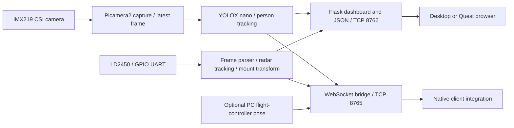

# Sensor rig handoff: Raspberry Pi, camera, radar and Meta Quest

Prepared for branch **`sensor-rig-integration`** on **2026-09-19**.
This is the entry point for operating, rebuilding and extending the sensor station.

## Current state

The Pi runs one Python process that captures the IMX219 camera, detects people,
reads LD2450 radar targets and serves a combined dashboard. Camera and radar are
shown together but **are not fused into matched person identities**. The radar
continues to work when the camera has no usable image. The saved left/right
correction is enabled; preserve it when restarting or integrating another client.

| Item | Verified configuration / state |
|---|---|
| Computer | Raspberry Pi 5 Model B Rev 1.1, aarch64 |
| OS / Python | Debian 13 (Trixie), Raspberry Pi packages; Python 3.13.5 |
| Hostname | `larp-pi`, usually reachable as `larp-pi.local` |
| Current LAN address | `172.20.10.3`; DHCP can change this |
| Existing workspace | `/home/evanl1307/HTN2026` |
| Git checkout | `/home/evanl1307/HTN2026/Sharingan` |
| Existing Python environment | `/home/evanl1307/HTN2026/.venv` |
| Camera | Sony IMX219 over CSI, Picamera2/libcamera |
| Detector | YOLOX nano, ONNX Runtime CPU, person class |
| Radar | Hi-Link LD2450 on `/dev/serial0` → `/dev/ttyAMA0` |
| Radar firmware | `V2.04.23101915`; multiple-target mode; zone filter disabled |
| Mount / test | Stationary bench; radar upright and forward-facing; level assumed |
| Position reference | Radar origin; positive right and forward, metres |
| Operator correction | `CV/radar_config.json`: `invert_x: true` |
| Display | Combined browser dashboard and a Quest browser layout |
| Native Quest integration | Bridge available; native radar parser/renderer and spatial registration pending |

The linked JSON evidence in [Docs/validation](Docs/validation/README.md) records
software/runtime checks. Through-drywall accuracy, standing-still person
performance, drone motion and an actual in-headset run remain unverified.

## Quick start on the existing Pi

The commands in this section run from the **Git repository root**, unlike older
workspace examples that include `Sharingan/` in the script path.

```sh
cd /home/evanl1307/HTN2026/Sharingan
../.venv/bin/python SensorRig/CV/pi_camera_stream.py --radar --quest-port 8765
```

Run only one camera/UART owner. If the dashboard is already live, use it rather
than launching another copy. `Ctrl+C` stops a foreground instance cleanly.

| Open from a device on the same reachable LAN | Purpose |
|---|---|
| `http://172.20.10.3:8766/` | Combined camera, radar, diagnostics and bench controls |
| `http://172.20.10.3:8766/quest` | Same live data, larger controls and reduced detail |
| `http://172.20.10.3:8766/radar` | Dedicated radar diagnostic page |
| `http://172.20.10.3:8766/handoff.json` | Connection manifest and coordinate/freshness contract |
| `ws://172.20.10.3:8765/` | JSON telemetry for the PC/Quest client |

Check without changing any hardware settings:

```sh
../.venv/bin/python SensorRig/CV/check_handoff.py --url http://172.20.10.3:8766 --seconds 4
../.venv/bin/python -m unittest discover -s SensorRig/CV/tests -v
```

The station launched during this work is detached, with its PID in the sibling
`../sensor-test/camera_dashboard.pid` and logs in
`../sensor-test/camera_dashboard.log`. These are local runtime files, not an
installed system service. After a reboot, start the command again. Before stopping
a detached process, inspect the saved PID with `ps -p <PID> -o args=` and confirm
it is `pi_camera_stream.py`; then use `kill -TERM <PID>`. A stale PID file can
refer to a different process. Do not kill all Python processes.

For an independent checkout with a repository-local `.venv`, substitute
`.venv/bin/python` for `../.venv/bin/python` in the commands above.

## Physical integration with the Pi

### IMX219 camera: CSI ribbon, not the UART

The camera connects to a Pi camera/display CSI connector using the appropriate
ribbon cable. A standard 15-pin camera module needs the Standard–Mini cable for
the Pi 5's 22-pin connector. Power down and disconnect power before reseating the
ribbon; follow the connector orientation in the
[Raspberry Pi camera installation guide](https://www.raspberrypi.com/documentation/accessories/camera.html#install-a-raspberry-pi-camera).

The live camera's device-tree path was:

```text
/base/axi/pcie@1000120000/rp1/i2c@80000/imx219@10
```

libcamera registered it with the PiSP pipeline, CFE `/dev/media0`, ISP
`/dev/media1`. Those numbered media nodes may change after a reboot or hardware
change. The actual cable's CAM/DISP label was not physically traced during this
handoff; preserve the working connection and verify enumeration if moving it.

The application uses camera index 0, `RGB888`, 640×480, a 24 fps capture request,
and a 180° software rotation. Picamera2's `RGB888` buffer is already BGR in memory
for this OpenCV path. **Do not add another red/blue swap.** An upright remount can
use `--rotation 0`; camera rotation is independent of radar X mirroring. See the
[Picamera2 manual](https://datasheets.raspberrypi.com/camera/picamera2-manual.pdf).

Only the station process should open the camera during a run. To diagnose a
missing camera after stopping the station, use `rpicam-hello --list-cameras`.
Check the ribbon, connector selection, boot overlay and OS camera packages if
IMX219 is absent. A USB camera can instead use `--source 0`, but that is not the
validated CSI setup.

### LD2450 radar: power plus two UART signal wires

The software verified `/dev/serial0 -> ttyAMA0`, with GPIO14 configured as TXD0
and GPIO15 as RXD0. Both measurement packets and command replies work, so both
UART directions are functional. The table below describes a valid direct
40-pin-header hookup for that pin mapping; the exact power/ground header holes
used on the current rig were not visually traced.

| LD2450 signal label | Pi physical pin | BCM GPIO / function |
|---|---|---|
| `5V` | 2 or 4 | 5 V power, **not** a GPIO signal |
| `GND` | 6, or another ground pin | Common ground |
| `TX` | 10 | GPIO15 / RXD0, radar → Pi measurements and replies |
| `RX` | 8 | GPIO14 / TXD0, Pi → radar diagnostic commands |

Cross TX to RX. Read the module's silkscreen/datasheet; do not assume a connector's
wire order from a photograph. The Pi UART signals use 3.3 V logic; do not connect
5 V power or an RS-232-level serial adapter to a GPIO signal pin. The radar's
power input is a separate 5 V connection. UART communication uses **256000 baud,
8 data bits, no parity, 1 stop bit**, with no hardware flow control. PA9 is not
used by this application. [Pi UART reference](https://www.raspberrypi.com/documentation/computers/raspberry-pi.html#configuring-uarts),
[Hi-Link module documentation](https://www.hlktech.com/cn/Goods-226.html).

Useful read-only checks on this Pi:

```sh
ls -l /dev/serial0
pinctrl get 14-15
id -nG
```

Expected pin report: GPIO14 = TXD0, GPIO15 = RXD0. The user currently belongs to
`dialout`, `video`, `render` and `gpio`, among other groups. Add the appropriate
user to `dialout` if serial access is denied, then log out/in:

```sh
sudo usermod -aG dialout "$USER"
```

Do not run a serial monitor or the standalone radar launcher while the combined
station owns the UART. Multiple readers can steal each other's bytes.

### Boot configuration observed on the working Pi

Relevant existing settings in `/boot/firmware/config.txt`:

```ini
camera_auto_detect=1

[pi5]
dtoverlay=nospi10

[all]
dtoverlay=imx219
enable_uart=1
```

This is an inventory of the working image, not a complete replacement file.
Other display/boot settings remain in that file. `/boot/firmware/cmdline.txt`
uses `console=tty1` and does not assign a login console to the radar UART.
On a replacement Pi, disable the serial login console and enable the hardware
UART through the OS configuration tool, then verify the device alias and pinmux.
The Pi 5's default serial alias on another image can differ; do not assume
`/dev/serial0` always means the GPIO14/15 UART. Use `--radar-port <device>` only
when it corresponds to the actual wired interface. Reboot after boot-config
changes; those changes were not needed or performed during this handoff.

## What each sensor produces, and how the processes fit together



`CV/camera_dashboard.py` is the shared runtime. Capture, inference and radar run
in separate workers. Capture retains one latest frame; inference processes each
selected frame ID once and annotates that exact image. There is no accumulating
video queue. Radar is sampled independently; it is not gated by camera detection.
The UI explicitly distinguishes camera people from radar targets.

### Camera pipeline

- Model: bundled `CV/detector/models/yolox_nano.onnx`, input 416×416, person class.
  [Model provenance and checksum](CV/detector/models/README.md).
- Preprocessing: aspect-preserving padding, BGR values 0–255; no `/255` input
  normalization for this YOLOX export. ONNX Runtime CPU uses two inference
  threads by default, with thread spinning disabled.
- Model scores ≥0.75 confirm immediately. Weaker tracks need two qualifying hits
  ≥0.50 among five distinct frames; existing tracks can sustain at ≥0.40.
- Briefly lost tracks can remain up to 350 ms and are marked `observed: false`.
  They are excluded from fresh person counts and exported world detections.
- Camera observations expire after 750 ms. Camera errors do not stop the radar.
- Detection works on the person class without requiring a face; it does not
  estimate body orientation, identity, posture or vital signs.
- Camera range is only a monocular estimate using an assumed 1.65 m person
  height and 62° horizontal field of view. Edge-clipped bodies have bearing only.
  These are not calibrated depth measurements.

Configuration is in `CV/detector/detector_config.json`. We corrected preprocessing,
tracking and runtime behavior; **no weights were retrained**. Other model names in
`detector_core.py` are historical registry entries; only the selected nano weights
are bundled. Changing the model name requires supplying compatible weights.

### Radar pipeline and coordinates

The standard stream has a 30-byte frame: `AA FF 03 00`, three 8-byte target slots,
then `55 CC`. Each target contains X/Y in mm, speed in cm/s and a range-bin size
in mm. X/Y/speed use the protocol's sign-magnitude convention, not normal signed
16-bit unpacking. Range-bin size is not position accuracy or confidence.

`radar_service.py` bounds/resynchronizes the serial buffer, applies a radial range
limit, associates observations, confirms three consecutive hits, and smooths with
an EMA (alpha 0.5). Raw measurements remain visible. Missing current observations
are not drawn as current contacts; 500 ms without radar packets clears positions.
Range gating does not impose the old, incorrect ±3 m sideways cutoff.

The startup diagnostics in `radar_protocol.py` enter configuration mode, query
firmware/tracking mode/zones, and exit. They do not flash firmware or persistently
rewrite sensor settings. Diagnostic replies require the Pi TX → radar RX wire;
a functioning one-way measurement stream can still work without those replies.

`CV/radar_config.json` is persisted atomically through the dashboard. Current:

```json
{
  "invert_x": true,
  "yaw_deg": 0.0,
  "offset_right_m": 0.0,
  "offset_forward_m": 0.0,
  "mount_level": true,
  "mounting_confirmed": true,
  "min_range_m": 0.1,
  "max_range_m": 6.0
}
```

The operator reported that left and right were reversed; `invert_x: true` fixes
that observed mounting. Do not revert it based on an assumed board orientation.
`right_m` is positive to the drone's right; `forward_m` points out the nose.
Origin is currently the radar, not the drone center. The board is upright and
forward-facing, with level mounting assumed for the bench experiment. If remounted,
repeat a measured left/right/forward check and update the configuration.

Processing order: mirror sensor X if enabled, rotate by clockwise mount yaw,
then add the sensor's right/forward displacement from the chosen reference origin.
New clients should use `drone_relative_radar_targets` or explicit metre fields,
and should **not mirror/rotate these already-transformed positions again**.
Raw `radar.raw_targets` X/Y are untransformed mm; legacy target `x`/`y` are mm in
the displayed frame. Radar confidence is unavailable and exported as null.

The LD2450 has no elevation measurement. These are level-sensor 2D estimates,
not fully measured 3D points. Software track IDs are not stable human identities.

### Drywall and drone limitations

A stationary test through interior drywall is the intended experiment. There is
no proven through-wall result for this wall and no software command that enables
a guaranteed wall-penetrating mode. Losses, layers/metal, reflections, moving
clutter and rear-lobe detection can create misses or misleading positions. The
module's advertised maximum detection distance is not a through-wall guarantee.

Use the combined page's **Bench tools** to record empty, clear-path and
behind-drywall scenes, with tape-measured coordinates. Test gentle movement and
standing still separately. Reports are written locally to `Radar/trials/`, which
is Git-ignored. A no-frame recording is not counted as a successful empty test;
position error is evaluated only on unambiguous single-target frames. See the
full [radar test procedure](Radar/README.md).

No drone motion compensation or camera/radar identity association is implemented.
Do not interpret a stable bench dot as evidence of accurate positioning on a
moving drone or accurate registration to the headset world.

## Reproduce the software on another Pi

Use 64-bit Raspberry Pi OS packages for the camera stack and OpenCV. From a clean
clone of this branch (repository root):

```sh
sudo apt update
sudo apt install python3-venv python3-picamera2 python3-opencv python3-numpy python3-serial python3-flask
python3 -m venv --system-site-packages .venv
.venv/bin/python -m pip install -r SensorRig/CV/requirements.txt
.venv/bin/python -m unittest discover -s SensorRig/CV/tests -v
.venv/bin/python SensorRig/CV/pi_camera_stream.py --radar --quest-port 8765
```

The system-site-packages option exposes Picamera2/libcamera and OS OpenCV to the
venv. Use `.venv/bin/python` directly: resolving that symlink to `/usr/bin/python`
can lose the virtual environment and its `websockets` package. Pi requirements
intentionally leave OpenCV to the OS; on a non-Pi computer, install a compatible
`opencv-python-headless` separately for tests/offline work. Do not replace the
working Pi's OpenCV/Picamera2 stack just to run the handoff check.

Observed working versions: Picamera2 0.3.37; OpenCV 4.10.0; NumPy 2.2.4;
ONNX Runtime 1.30.0; Flask 3.1.1; pyserial 3.5; websockets 17.1. They are observations,
not a fully locked OS image. A fresh OS install was not performed for this handoff.
`pip check` on the inherited system-site-packages environment reports pre-existing
unrelated developer/system-package gaps; application imports and tests pass.

The selected 3.5 MB ONNX model is included in ordinary Git. The Unreal project
also contains Git LFS assets: installing Git LFS and retrieving those assets is
needed for native project work, but the Pi runtime does not load Unreal content.
Do not mistake a checked-out Git LFS pointer for a real PDF/model/texture.

## API and Meta Quest handoff

The full field contract and native work list are in
[Docs/quest_handoff.md](Docs/quest_handoff.md). Important endpoints:

| Endpoint | Behavior |
|---|---|
| `/`, `/quest` | Combined views; independent sensor health and stale clearing |
| `/detections` | Camera observations, timing, full radar snapshot, bridge status |
| `/stream` | Annotated MJPEG, `X-Frame-Id` per image part |
| `/snapshot.jpg` | Current JPEG or waiting image |
| `/healthz` | Camera health: 200 fresh, 503 otherwise; 503 does not mean radar is down |
| `/radar/targets` | Radar-only JSON, independent of camera visibility |
| `/radar/config` | POST complete mounting configuration |
| `/radar/trials` | GET status/reports; POST labelled bench trial |
| `/radar.json` | Older combined compatibility format, position fields in mm |
| `/handoff.json` | Host-derived URLs, axes, mounting, TTLs and integration status |
| WebSocket 8765 | `schema_version: 1`, camera/world and separate local radar arrays |

For the browser handoff, open `/quest` on the same reachable LAN and run the
page's connection check **on the headset**. The Pi-side check does not prove that
the Quest can reach the network. Full screen is a browser feature, not WebXR.
This LAN development server has no authentication/TLS; use it on the intended
private test network and add access control before exposing it elsewhere.

For native clients: camera world `detections` require a fresh rig pose; local
`drone_relative_radar_targets` do not. Pose expires after 1000 ms. The optional
`--stationary-rig` flag explicitly selects a fixed bench reference; it is not a
substitute for a moving-rig pose. Do not send fabricated poses to make contacts
appear. For an aligned Unreal local frame, X cm = forward metres ×100, Y cm =
right metres ×100, and Z remains unobserved.

Native code changes in this branch enable `-WallhackBridge` and
`-WallhackBridgeUrl=ws://<pi-address>:8765/`, and allow telemetry rendering instead
of returning early to navigation. Native radar-array parsing/rendering is still
pending, as are native build/deployment and physical headset registration. No
Quest/adb or Unreal build toolchain was attached here.

## Optional PC flight controller and IMU

`Fusion/imu_viz.py` runs on the **PC**, using MSP on its configured serial port
(default `COM4`, 115200 baud). It sends `rig: {x, y, heading_deg, tracking_ok}` to
the Pi WebSocket and reads the camera stream. Change `PORT`, `BRIDGE_URL` and
`PI_STREAM_URL` for that computer/network. This is a separate connection from the
LD2450's Pi UART. Its acceleration integration/dead-reckoning can drift; it is
not a verified world-position reference.

That utility also contains motor test controls. The camera/radar dashboard does
not command motors and does not need the flight controller to be armed. Follow
[Firmware/README.md](Firmware/README.md) for that separate bench procedure.
Do not run multiple processes against the same flight-controller serial port.

## Verification, source map and remaining work

The application has 39 passing unit tests. The browser checks cover combined and
Quest layouts, live WebSocket receipt, independent sensor failures, frozen-frame
expiry, HTTP loss/recovery and the corrected left/right plot. Runtime evidence
shows roughly 10 camera detections/s, 24 capture fps and 11.2 radar reports/s on
this rig. Latest measured median inference was about 52 ms; rates depend on load.

Development camera replay detected 370/379 person-present frames and 0/146 empty
frames. The 525 images were used during tuning, eleven empty walking frames had
reviewed label corrections, and there are no ground-truth boxes or held-out
people/rooms. This is presence recall, not localization mAP or a general accuracy
guarantee. Model weights were unchanged. The raw evaluation clips and historical
experiment files live in sibling `../sensor-test/` on the original Pi and are not
required for runtime. Portable summaries are committed under `Docs/validation`.

| File / directory | Ownership |
|---|---|
| `CV/camera_dashboard.py` | Capture, inference, Flask and optional services |
| `CV/detector/` | Model registry, ONNX weights, preprocessing, person tracking/config |
| `CV/radar_service.py`, `radar_protocol.py` | UART measurements, diagnostics, tracking and mounting |
| `CV/radar_web.py`, `radar_trials.py` | Radar endpoints and labelled recording |
| `CV/dashboard.html`, `radar_controls.html`, `static/` | Combined and Quest browser UI |
| `CV/quest_bridge.py`, `check_handoff.py` | Telemetry transport and live contract checks |
| `CV/tests/` | Hardware-independent regression tests |
| `Fusion/wallhack_dashboard.py` | Compatibility combined launcher |
| `Radar/ld2450_radar.py` | Radar-only alternative on 8767; stop combined mode first |
| `Docs/quest_handoff.md` | Detailed Quest contract, physical checks and native next steps |

Next work, in order: measure drywall/empty-room performance; check known physical
coordinates and sensor height; test `/quest` on the headset; implement the separate
native radar minimap parser/renderer and expiry tests; register the rig to headset
space if a room-anchored view is needed. Validate moving-drone behavior separately.

## Troubleshooting

| Symptom | What to check |
|---|---|
| Camera busy / duplicate UART owner | Stop the known prior station; do not run standalone radar alongside it |
| Radar disconnected | 5 V/common ground, TX→RX wiring, 256000 baud, correct device alias, `dialout`, pinmux and competing readers |
| Radar live but diagnostics time out | Pi TX → radar RX connection; measurement-only RX can still function |
| Left/right wrong after remount | Measure a point on each side; update mirror once in mount config; avoid double-transforming in clients |
| No camera detections / odd colors | Correct BGR path, correct model, raw 0–255 YOLOX input, camera rotation and exposure |
| Old dots/boxes remain | Inspect source age/frame IDs; respect independent TTLs rather than holding the last payload |
| Camera health 503, radar live | Expected independent health semantics; inspect `/radar/targets` |
| Dashboard inaccessible | `hostname -I`, same reachable LAN, TCP 8766, AP/client isolation |
| HTTP works, bridge fails | Start with `--quest-port 8765`; check TCP 8765 and manifest URL |
| Native HUD has no contacts | Missing world pose for camera detections, or native radar array not yet implemented |
| Dot near the sensor even in an empty camera image | Camera FOV is not radar coverage; investigate clutter, rear lobes and empty baselines |
| `websockets` missing despite installation | Invoke the venv interpreter directly, not its resolved system-Python target |
| Changes disappear after reboot | Runtime is manually started; the PID/log files are not an auto-start service |
